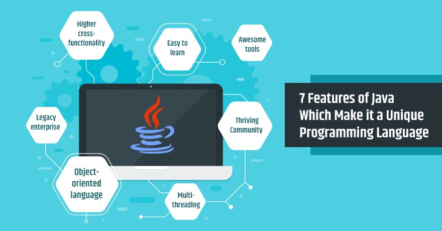

# Fibabanka Java Bootcamp - 1. Hafta

## Java programlama dilinin temelleri
### Java nedir ve neden önemlidir ?



Java ilk olarak 1991 yılında OAK ismiyle ortaya çıktı daha sonra 1995 yılında Java ismiyle ilk kez piyasaya sürüldü.
En başta tost makinası, elektikli süpürge gibi son kullanıcı elektronik ürünler için tasarlanmış olsa da daha sonra 
internetin programlama dili oldu ve internetin bu denli gelişmesinde kilit rol oynadı. Bu nedenle ilk günden itibaren
platform bağımsız olarak tasarlandı. Güçlü yapısı, sunduğu güvenlik ve taşınabilirliği ve genel bir programlama dili olması
popülerliğini biranda artırdı.

Javanın başarısının arkasında yatan sihir Bytecode. Java kodları doğrudan CPU üzerinde çalıştırılmaz. Önce Bytecode a çevrilir
sonra Bytecode, Java Virtual Machine(JVM) dediğimiz sistem tarafından yorumlanır. Bu bytecode dönüşümü ve JVM mantığı 
Javaya platform bağımsızlık ve güvenlik özelliklerini kazandırmıştır.

Diğer bir güçlü özelliği de nesne tabanlı olmasıdır. Bu özellik dile gerçek dünyayı kolayca modelleme ve programlama 
gücü katmıştır.

Kolay öğrenilebilen bir dil olması ve yukarıda saydığımız özellikler Javayı yıllardır programcıların gözünde hep zirvede
tuttu.

### Java ile geliştirme yapmak için nelere ihtiyacım var ?
- Algoritmik dusunme yetenegine
- JDK (Java Development Kit)
- IDE (Integrated Development Environment)*

#### Bootcamp için nelere ihtiyacım var
- Git
- Github


#### JDK ya yakından bakış
JDK, Java dilinde yazdığımız uygulamaları compile etmek ve çalıştırmak için gerekli olan altyapıyı sunar. Şuanda güncel
olarak 15. versiyonu yayınlanan JDK, Oracle firmasının [adresinden](https://www.oracle.com/java/technologies/javase-downloads.html)
ve open source olarak piyasaya sunulan [adresten](http://jdk.java.net/) indirilip kurulabilir. Bu eğitim serisinde biz 
en son devrim niteliği taşıyan JDK'nın 8 numaralı versiyonunu kullanacağız.

JDK bize iki temel program sunar; birincisi kodları compile eetmek için kullanılan **javac**, ikincisi ise compile edilmiş 
kodları yorumlayan ve uygulamayı çalıştıran **java**. Bu anlamda JDK ekranları olan bir uygulama değildir, sadece komut satırı
uygulamalrı sunan bir platformdur. Bir IDE de değildir, IDE'ler de kodları derlemek ve çalıştırmak için JDK kullanır.

#### IDE
Java dilinde uygulama yazmayı kolaylaştıran bunun yanında da yazılımcının üretkenliğini destekleyen pek çok IDE mevcuttur 
piyasada. Bunlardan en popüler olanları Eclipse, IntelliJ IDE denilebilir. IDE sadece kodlamayı kolaylaştırmak ve daha verimli 
hale getirmek için vardır, IDE olmadan da sadece JDK kullanarak geliştirme yapılabilir.

### Java ile ilk program
``` java
package com.hkarabakla;
 
 public class Main {
 
     public static void main(String[] args) {
        // Bu tek satırlık bir yorum
        
        /*
            Bu çok satırlık
            bir yorum
         */
 	    System.out.println("Merhaba Java Bootcamp !");
     }
 }
```
- package : İlişkili sınıfları gruplamamıza yarayan dizinler olarak düşünebiliriz. 
- class   : Nesne yönelimli bir programlama dili olan Java’da herşey bir class ile ilişkilendirilmek zorundadır. 
  Class gerçek dünyayı yazılımda modellememize yardımcı olur
- method  : Fonksiyon olarak da bilinen methodlar yazılımı oluşturan en küçük birimlerdir. Yazılıma davranış kazandırırlar.

## Veri tipleri ve operatörler
Java **strongly typed** bir dildir. Yani bütün işlemler compile zamanında type checking (veri tipi kontrolü) işleminden 
geçirilir.

### Primitive (basit) veri tipleri
Primitive tipler belli bir boyuta sahiptir ve ekstra fonksiyon sunmazlar.

| Veri tipi | Boyut | Açıklama |
| ----------- | ----------- | ---------- |
|byte	| 1 byte	| -128 den 127 e kadar tüm sayıları tutar |
|short	| 2 bytes	| -32,768 den 32,767 e kadar tüm sayıları tutar |
|int	| 4 bytes	| -2,147,483,648 den 2,147,483,647 e kadar tüm sayıları tutar |
|long	| 8 bytes	| -9,223,372,036,854,775,808 den 9,223,372,036,854,775,807 e kadar tüm sayıları tutar |
|float	| 4 bytes	| Ondalıklı sayıları tutar. 6 ila 7 aded rakam içeren sayılar için uygundur |
|double	| 8 bytes	| Ondalıklı sayıları tutar. 15 aded rakam içeren sayılar için uygundur |
|boolean	| 1 bit	| true yada false değerlerini tutar |
|char	| 2 bytes	| Tek bir karakter yada harf tutar |

### Non-Primitive veri tipleri
Referans tipler olarak da bilinen tum objeler bu gruba girer.
``` java
String name = "Huseyin";
Car myNewCar = new Car("A4", "Audi");
```

#### Primitive tipler ve non-primitive tipler arasındaki farklar
- Primitive tipler java tarafından öntanımlı olarak sunulmaktadır fakat non-primitive tipler yazılımcı tarafından yaratılır. (String hariç)
- Non-primitive tipler tuttukları değer üzerinde işlem yapmaya yarayan metodlar sunabilirler
- Primitive tipler her zaman bir değere sahip olmak zorundadır bu nedenle default değerleri vardır, non-primitive tipler ise null olabilir
- Primitive tipler hafızada stack denilen bir bölgede saklanırken, referans tiplerin referans kısımları stack'de referansların
işaret ettiği gerçek objeler heap denilen özel alanda saklanır.

### Değişkenler
Değişkenler verileri (data) depolamaya yarar.
``` java
// Genel değiken tanımlama
// type variable = value*;

int age = 10;
String organisation = "Kodluyoruz";
boolean isCool = true;

int x = 2, y = 3, z = 5;

int a, b, c;
a = 1;
b = 9;
c = 11;

// Good
int minutesPerHour = 60;
// OK, but hard to understand its purpose
int m = 60;
```
#### Değişken isimlerini belirlemede uyulması gereken kurallar:
- Değişken isimleri anlamlı ve değişkenin görevini açıklar nitelikte olmalıdır
- Değişken isimleri harf, rakam, alt çizgi(_) ve dolar işareti($) bulundurabilir
- Sadece harf ile başlayabilir
- Küçük harfle başlamalıdır ve boşluk içeremez
- $ ve _ ile de başlayabilir fakat yaygın olarak tercih edilmez
- Değişken isimleri büyük küçük harfe duyarlıdır
- Int, boolean… gibi Java için rezerve edilmiş kelimeler değişken ismi olamaz

#### Tanımlama sırasında değer atama
```java
int age = 10;
String organisation = "Kodluyoruz";
boolean isCool = true;
```
#### Dinamik değer atama
```java
int x = 2, y = 3, z = 5, w;
w = x * y * z;
```
#### Degişkenlerde scope kavramı
Java dilinde her değişken  kıvırcık parantezler içinde tanımlanmalıdır. Kıvırcık parantez içinde tanımlanan değişken
parantezler dışında ulaşılazmadır, alt kıvırcık parantezler içinde de ulaşılabilirdir. [Örneğimizi](../../examples/src/com/hkarabakla/fundamentals/FundamentalsDemo1.java) inceleyelim.
```java
package com.hkarabakla;

public class FundamentalsDemo1 {

    public static void main(String[] args) {
        int x = 10; // known to all code within main

        if (x == 10) { // start new scope
            int y = 20; // known only to this block

            // double x = 25; error, variable x already defined  

            // x and y both known in here
            System.out.println("x and y : " + x + " " + y);
            x = y * 2;
        }

        // y = 100; error y not known here
        
        // x still known here
        System.out.println("x is " + x);
    }
}
```
#### Tip dönüştürme (Type casting)
Bir tipte tanımlanmış değerin başka bir tipte tanımlanmış değişkene atanmasıdır. İki şekilde olur :

**Otomatik tip dönüşümü**

Küçük boyutlu bir değerin daha büyük boyutlu bir tipte değişkene atanmasıdır.
_byte -> short -> char -> int -> long -> float -> double_

```java
public class MyClass {
  public static void main(String[] args) {
    int myInt = 9;
    double myDouble = myInt; // Automatic casting: int to double

    System.out.println(myInt);      // Outputs 9
    System.out.println(myDouble);   // Outputs 9.0
  }
}
```

**Manuel tip dönüşümü**

Büyük boyutlu bir değerin daha küçük boyutlu bir tipte değişkene atanmasıdır, bu durumda değer kaybı yaşanabilir.
_double -> float -> long -> int -> char -> short -> byte_ 

```java
public class MyClass {
  public static void main(String[] args) {
    double myDouble = 9.78;
    int myInt = (int) myDouble; // Manual casting: double to int

    System.out.println(myDouble);   // Outputs 9.78
    System.out.println(myInt);      // Outputs 9
  }
}
```

### Operatörler
Operatörler değişkenler ve değerler üzerinde işlem yapmaya yarar.

#### Aritmetik operatörler
|Operator	|Name	|Description	|Example|
| ----------- | ----------- | ---------- | ---------- |
|+	|Addition	|Adds together two values	|x + y	|
|-	|Subtraction	|Subtracts one value from another	|x - y|	
|*	|Multiplication	|Multiplies two values	|x * y	|
|/	|Division	|Divides one value by another	|x / y	|
|%	|Modulus	|Returns the division remainder	|x % y	|
|++	|Increment	|Increases the value of a variable by 1	|++x|	
|--	|Decrement	|Decreases the value of a variable by 1	|--x|

#### Atama operatörleri
|Operator	|Example	|Same As|
| ----------- | ----------- | ---------- |
|=	|x = 5|	x = 5|	
|+=	|x += 3|	x = x + 3|	
|-=	|x -= 3|	x = x - 3|	
|*=	|x *= 3|	x = x * 3|	
|/=	|x /= 3|	x = x / 3|	
|%=	|x %= 3|	x = x % 3|	
|&=	|x &= 3|	x = x & 3|	
||=	|x |= 3|	x = x | 3|	
|^=	|x ^= 3|	x = x ^ 3|	
|>>=	|x >>= 3|	x = x >> 3|	
|<<=	|x <<= 3|	x = x << 3|

#### Karşılaştırma operatörleri
|Operator	|Name	|Example|
| ----------- | ----------- | ---------- |
|==|	Equal to|	x == y|	
|!=|	Not equal|	x != y|	
|\>	|Greater than|	x > y|	
|<|	Less than|	x < y|	
|>=|	Greater than or equal to|	x >= y|	
|<=|	Less than or equal to|	x <= y|

#### Mantıksal operatörler
|Operator	|Name	|Description	|Example|
| ----------- | ----------- | ---------- | ---------- |
|&& 	|Logical and	|Returns true if both statements are true	|x < 5 &&  x < 10|	
| &#124;&#124; 	|Logical or	|Returns true if one of the statements is true	|x < 5 &#124;&#124; x < 4|	
|!	|Logical not	|Reverse the result, returns false if the result is true	|!(x < 5 && x < 10)|

## Karar mekanizmaları ve döngüler


Karar mekanizmaları ve döngüler uygulama içindeki akışı kontrol etmek için kullanılır. Kimi zaman bazı koşullar altında
bir kod parçasının çalıştırılmasını isterken kimi zaman da o koşulun gerçek olmaması durumunda başka kod parçalarının 
çalıştırılmasını isteriz, işte bu durumda yardımımıza **if**, **if-else** ve **switch** ifadeleri yetişir. Bazen ise bir 
kod parçasının defalarca çalıştırılması gerekir, bu durumda ise **for** ve **while** döngü ifadeleri istediğimiz kadar tekrarlı 
kod çalıştırmamızı sağlar. Şimdi bu ifadelerin detaylarına ve örneklerine bakalım.

### Konsoldan Scanner yardımıyla input alma
Karar mekanizmaları ve döngü ifadeleri örneklerini zenginleştirmek için konsoldan değer okuma işleminin Scanner sınıfı
ile [nasıl yapıldığına](../../examples/src/com/hkarabakla/fundamentals/FundamentalsDemo2.java) bakalım.

```java
import java.util.Scanner;

public class FundamentalsDemo2 {

    public static void main(String[] args) {

        System.out.println("Welcome " + getUserDeatils());
    }

    private static String getUserDeatils() {
        Scanner scanner = new Scanner(System.in);
        System.out.print("Enter your name : ");
        String name = scanner.next();
        System.out.println();
        System.out.print("Enter your age : ");
        int age = scanner.nextInt();

        return name + " " + age;
    }
}
```
Output :
```
Enter your name : Huseyin

Enter your age : 33
Welcome Huseyin 33
```
Örnekte Scanner sınıfından bir obje yarattık (Obje ve sınıf kavramlarına daha sonra değineceğiz), Scanner sınıfına klavyeden 
girilen değerleri okuması için System.in input stream objesini verdik. scanner objesinin next() metodu consoldan girilen 
ilk kelimeyi okur ve String tipinde geri döner, nextInt() metodu ise ilk kelimeyi okur ve int tipinde geri döner. 
Böylece kullanıcı ile etkileşim kurmuş oluruz. Bundan sonraki örnekleri anlayabilmek için bu kadar bilgi yeterli.

### if-else ifadesi
if ifadesi belirli bir koşul altında program akışımının hangi yöne devam edeceğini belirler. [Örneğin](../../examples/src/com/hkarabakla/fundamentals/FundamentalsDemo3.java);

```java
import java.util.Scanner;

public class FundamentalsDemo3 {

    public static void main(String[] args) {

        Scanner scanner = new Scanner(System.in);
        System.out.print("Enter your age : ");
        int age = scanner.nextInt();
        System.out.println("Your availability for driving licence : " + isEligibleToHaveADrivingLicence(age));
    }

    public static boolean isEligibleToHaveADrivingLicence(int age) {

        if(age < 18) {
            System.out.println("It's too early to drive !!!");
            return false;
        }

        return true;
    }
}
```
Output :
```
Enter your age : 11
It's too early to drive !!!
Your availability for driving licence : false
```

else ifadesi ise if koşulu gerçekleşmemesi durumda program akışının gideceği yönü belirlemeye yarar. [Örneğin](../../examples/src/com/hkarabakla/fundamentals/FundamentalsDemo4.java);

```java
import java.util.Scanner;

public class FundamentalsDemo4 {

    public static void main(String[] args) {

        Scanner scanner = new Scanner(System.in);
        System.out.print("What is the time : ");
        int time = scanner.nextInt();

        if (time < 18) {
            System.out.println("Good day.");
        } else {
            System.out.println("Good evening.");
        }
    }
}
```
```
What is the time : 19
Good evening.
```

if-else-if ifadesi ise if koşulu gerçekleşmediği taktirde ikinci bir koşulu test etmeye yarar. [Örneğin](../../examples/src/com/hkarabakla/fundamentals/FundamentalsDemo5.java);

```java
import java.util.Scanner;

public class FundamentalsDemo5 {

    public static void main(String[] args) {

        Scanner scanner = new Scanner(System.in);
        System.out.print("What is the temperature today : ");

        int temperature = scanner.nextInt();

        if (temperature < 20) {
            System.out.println("A little bit cold.");
        } else if (temperature < 25) {
            System.out.println("It's cool.");
        } else {
            System.out.println("It's warm, drink water.");
        }
    }
}
```
Output :
```
What is the temperature today : 23
It's cool.
```

İstediğimiz kadar if-else-if ifadesini zincirleme kullanabiliriz, fakat if-else-if ifadesi nekadar çok kullanılırsa 
kodun okunabilirliği okadar azalır. Bu nedenle Java'da daha okunabilir, daha sade ve daha çok esneklik sunan 
switch ifadesi **bir değişkenin birden fazla değer alabildiği durumlarda** if-else-if ifadesi yerine tercih edilebilir.

### switch ifadesi
Bir değere bağlı olarak birden fazla koşul ve kod akışı olasılığı söz konusu olduğu durumlarda switch ifadesi kullanılabilir.
Bu değer **byte, short, int, char yada String** tipinde olabilir. [Örneğin](../../examples/src/com/hkarabakla/fundamentals/FundamentalsDemo6.java);

```java
import java.util.Scanner;

public class FundamentalsDemo6 {

    public static void main(String[] args) {

        Scanner scanner = new Scanner(System.in);
        System.out.print("Enter the number of the day : ");

        int numberOfTheDay = scanner.nextInt();

        System.out.println("Today is " + getDayNameOfWeek(numberOfTheDay));
    }

    public static String getDayNameOfWeek(int dayOfTheWeek) {

        String nameOfTheDay;

        switch (dayOfTheWeek) {
            case 1:
                nameOfTheDay = "Monday";
                break;
            case 2:
                nameOfTheDay = "Tuesday";
                break;
            case 3:
                nameOfTheDay = "Wednesday";
                break;
            case 4:
                nameOfTheDay = "Thursday";
                break;
            case 5:
                nameOfTheDay = "Friday";
                break;
            case 6:
                nameOfTheDay = "Saturday";
                break;
            case 7:
                nameOfTheDay = "Sunday";
                break;
            default:
                nameOfTheDay = "Unknown";
        }

        return nameOfTheDay;
    }
}
``` 
Output :
```
Enter the number of the day : 3
Today is Wednesday
```
switch ile test ettiğimiz değer hiçbir case ifadesi ile eşleşmezse default ifadesi altında yeralan kod çalıştırılır. Burada
default ifadesi opsiyoneldir, eğer default olarak çalıştırmak istediğimiz bir kod yoksa hiç switch ifadesine eklenmeyebilir.

break ifadesi eşleşen case ifadeisnin işletilmesinden sonra switch ifadesinden kod akışının çıkmasını sağlar. switch ifadesi 
bizim için birden fazla koşuldan herhangi birinin gerçekleşmesi durumunda aynı kod akışının işletilmesine olanak sağlar,
[Örneğin](../../examples/src/com/hkarabakla/fundamentals/FundamentalsDemo7.java);

```java
    import java.util.Scanner;

public class FundamentalsDemo7 {

    public static void main(String[] args) {

        Scanner scanner = new Scanner(System.in);
        System.out.print("What would you like to eat ? : ");

        String nameOfTheFood = scanner.next();

        System.out.println("This is " + classifyFood(nameOfTheFood));
    }

    public static String classifyFood(String nameOfTheFood) {
        String foodType;

        switch (nameOfTheFood) {
            case "apple":
                System.out.println("This is an apple");
            case "banana":
                System.out.println("This can be an apple or banana");
                foodType = "fruit";
                break;
            case "aubergine":
                System.out.println("This is aubergine");
            case "broccoli":
                System.out.println("This can be an aubergine or broccoli");
                foodType = "vegetable";
                break;
            default:
                System.out.println("Don't eat that food");
                foodType = "Unknown";
        }

        return foodType;
    }
}
``` 
Output :
```
What would you like to eat ? : apple
This is an apple
This can be an apple or banana
This is fruit

---------------------------------------

What would you like to eat ? : banana
This can be an apple or banana
This is fruit
``` 
Bu örnekte switch ifadesinde test edilen değişkenin hangi case durumu ile eşleştiyse o case'den itibaren altındaki tüm caselerin 
break ifadesi ile karşılaşıncaya kadar işletildiğine dikkat edelim. 


### Döngüler
Java'da döngüler tekrarlı işleri gerçekleştirmek için kullanılır.

#### for döngüsü
Bu döngü tipi kaç defa kod bloğunun çalıştırılması gerektiği bilindiği durumlarda kullanılır. Genel yapısı aşağıdaki gibidir;

```java
    for(initialization; condition; iteration) {
        statement sequence;
    }
```
Initialization ifadesi döngü kontrol değişkeninin tanımlandığı ve ilk değerini aldığı kısımdır.
Condition ifadesi döngünün hangi şartlar altında devam edeceğinin belirlendiği kısımdır.
Iteration ifadesi ise döngü kontrol ifadesinin her bir döngü adımında nasıl değişeceğinin belirlendiği kısımdır.

```java
    for (int i = 0; i < 5; i++) {
      System.out.println(i);
    }
```
Output :
```
    0
    1
    2
    3
    4
```
Yukarıdaki örnekte int tipinde i değeri 0 olarak tanımlanmış ve döngünün i 5den küçük olduğu sürece tekrarlanması istenmiş.
Döngünün her adımı tamamlanınca yani if bloğunun içi çalıştırılıp bitince i değeri 1 artırılmış.

```java
    for(int i = 0, j = 10; i < j; i++, j--) {
        System.out.println("i and j :" + i + " " + j);
    }
```
Output :
```
    i and j :0 10
    i and j :1 9
    i and j :2 8
    i and j :3 7
    i and j :4 6
```
Bu örnekte ise i ve j olmak üzere iki farklı değer kullanılmış döngüyü kontrol etmek için. Her döngü adımında i değeri 1 artırılırken
j değeri ise 1 azaltılmış ve i j'den küçük olduğu sürece döngünün tekrarlanması sağlanmış.

```java
    int i = 0;
    for(; i < 5;) {
        System.out.println("i :" + i++);
    }
```
Output :
```
    i :0
    i :1
    i :2
    i :3
    i :4
```
Bu örnekte ise i değeri döngü dışında tanımlanmış ve döngünün i değeri 5ten küçük olduğu sürece çalışması istenmiş. i değerinin
değiştirilmesi işi ise döngü bloğunun içinde yapılmış.

> Not : for döngüsünün farklı bir versiyonu olan foreach döngüsüne daha sonra array konusuna işlediğimiz zaman değineceğiz.

#### while dongusu
while döngüsü ise döngünün kaç defa işletileceğinin bilinmediği ama hangi koşul devam ettiği sürece tekrar edeceği bilindiği
durumlarda kullanılır. Genel yapısı aşağıdaki gibidir;

```java
    while(condition) {
        statement sequence;
    }
```

Condition ifadesi döngünün hangi şartlar altında devam edeceğine karar verilen kısımdır, condition true olduğu sürece döngü
tekrar eder.

```java
    int i = 0;
    while (i < 5) {
      System.out.println(i);
      i++;
    }
```

while döngüsü çalışmaya condition ifadesinin sonucunu kontrol ederek başlar ve her adımda değer kontrol edilir, condition 
ifadesi true döner ise döngü içindeki kod çalıştırılır. false döndüğü durumda döngü son bulur.

while döngüsünün özel bir şekli olan do-while döngüsünde ise önce do ifadesinin içinde bulunan kod öalıştırılır daha 
sonra while ifadesinin içinde yeralan condition ifadesinin döndüğü değere bakılır. do-while döngüsünde döngünün en az 
bir kere çalışması garantidir.

```java
    int i = 5;
      do {
         System.out.println("Iteration: "+ ++i);
      } while(i < 5);
```
Output :
```
Iteration: 6
```

#### break ve continue ifadeleri
Bazı durumlarda döngünün ne zaman sonlanacağına döngü içerisinde karar vermek gerekebilir. Bu durumda break ifadesi 
döngüyü bitirmeye yarar.

```java
    for (int i = 0; i < 10; i++) {
      if (i == 4) {
        break;
      }
      System.out.println(i);
    }
```
Output :
```
0
1
2
3
```
Bu örnekte döngünün normalde 10 adımda sonlanması gerektiği döngü tanımında belirlenmiştir, fakat döngü içerisinde 5. adımda
i değerinin 4 e eşit olduğu durumda break ile döngüden çıkılmıştır. break ifadesi tüm döngü yapılarında (for, while ve do-while)
kullanılabilir.

```java
    while (true) {
        char ch = (char) System.in.read();
        if (ch == 'q') {
            break;
        }
    
        System.out.println(ch);
    }
```

Bazı durumlarda ise döngü içerisinde işletilen adımın pas geçilmesi istenebilir. Bu durumda continue ifadesi, döngü iöerisinde 
continue'dan sonra gelen kodun çalıştırılmadan bir sonraki döngü adımına geçilmesini sağlar.

```java
    for (int i = 0; i < 100; i++) {
        if (i % 10 != 0) {
            continue;
        }
        System.out.println("I : " + i);
    }
```

Output :
```
    I : 0
    I : 10
    I : 20
    I : 30
    I : 40
    I : 50
    I : 60
    I : 70
    I : 80
    I : 90
```
Yukardaki örnekte 0dan 99a kadar sayılmış ve sadece onun katlarında konsola değer yazılması sağlanmıştır, diğer durumlarda
döngü adımı pas geçilmiş.

## Nesneye Yönelik Programlama (OOP)


Nesne (object) Java dilinin özüdür temelde. Nesneler sınıflardan (class) üretilir ve sınıf kavramı Java dilinin temel yapı taşıdır.
Bu nedenle Java dilini anlamak için sınıf ve nesne kavramını çok iyi anlamak gerekir.

Etrafımızda gördüğümüz herşey bir nesne olarak modellenebilir. Nesneye dayalı programlamanın gücü de burdan gelir. Gerçek hayatı
modellemek için iyi bir araçtır.

### Class ve Object kavramları


Javada bütün olay sınıfların içinde döner, aslında eğitimin başından beri sınıfları çokca kullandık fakat oldukça basit sınıflardı bunlar.
Bir sınıf çeşitli türden veriler ve bu veriler üzerinde işlem yapmaya yarayan metodlar içerir. Bu haliyle sınıf nesneler için
bir şablon görevi görür, yani tek başına sınıf bir işe yaramaz. Onun hafızada bir yer kaplaması ve programın döngüsüne katılabilmesi için
kendisinden nesneler yaratılmalıdır.

Sınıfın içinde bulunan verilere ve metodlara sınıfın üyeleri adı verilir. Sınıfın içinde bulunan verilere tek başına 
instance variable da denir.


Bir sınıf hem veri hem metod barındırabileceği gibi bunlardan sadece birini de barındırabilir. Bir sınıfın genel tanımı 
aşağıdaki gibidir;

```java
class ClassName {
    // declare instance variables
    type var1;
    type var2;
    // ...
    type varN;

    // declare methods
    type method1(parameters) {
     // body of method
    }
    type method2(parameters) {
     // body of method
    }
    // ...
    type methodN(parameters) {
     // body of method
    }
}
```

Bir sınıf tanımlarken burada önemli olan sınıfın birbiri ile alakalı bilgiler içeriyor olmasıdır. Örneğin bür stok 
yönetimi uygulamasında bir kullanıcı sınıfı tanımlıyorsak içine kullanıcı adı, email adresi gibi bilgiler koyarken 
stok bilgisi ile alakalı veriler koymaktan kaçınmalıyız.

Şimdi bir Vehicle sınıfı yaratalım ve [bundan nesneler üretelim](../../examples/src/com/hkarabakla/oop/demo1/OopDemo1.java);

```java
public class Vehicle {

    int passengers;
    double fuelCapacity;
    int fuelConsumptionPerKm;
}

public class OopDemo1 {

    public static void main(String[] args) {

        Vehicle minivan = new Vehicle();
        minivan.passengers = 7;
        minivan.fuelCapacity = 70;
        minivan.fuelConsumptionPerKm = 6;

        double range = minivan.fuelCapacity / minivan.fuelConsumptionPerKm;
        System.out.println("Minivan can carry " + minivan.passengers + " people for " + range + " km");
    }
}
```
Output :
```
Minivan can carry 7 people for 11.666666666666666 km
```

#### Instance variables
Daha önce sinif degişkenlerine instance variables denildiğini öğrenmiştik. Şimdi bu değikenlere biraz daha yakından bakalım.
Bu değişkenlerin default değerleri vardır, yani bir sınıftan bir instance yarattığımızda eğer değişkenlerine biz değer atamaz ise
Java arka planda bu değişkenlere bir default değer ataması yapar. [Örneğin](../../examples/src/com/hkarabakla/oop/demo2/OopDemo2.java);

```java
public class Vehicle {
    int passengers;
    double fuelCapacity;
    int fuelConsumptionPerKm;
    boolean isSport;
    String brand;
}

public class OopDemo2 {

    public static void main(String[] args) {

        Vehicle minivan = new Vehicle();
        System.out.println(
                "Brand " + minivan.brand +
                " passengers : " + minivan.passengers +
                " fuel capacity : " + minivan.fuelCapacity +
                " consumption per km : " + minivan.fuelConsumptionPerKm +
                " is sport car : " + minivan.isSport
        );
    }
}
```
Output :
```
Brand null passengers : 0 fuel capacity : 0.0 consumption per km : 0 is sport car : false
```
Burada gördüğümüz gibi instance değişkenlere değer atanmadığı için default değerleri java tarafından atandı.

#### Metodlar
Daha önce instance değişkenlerini görmüştük şimdi ise bu değişkenler üzerinde işlem yapmak için metod tanımına bakacağız.
Metodların genel yapısı aşağıdaki gibidir;

```java
return-type methodName( parameter-list ) {
    // body of method
}
```

Burada methodName metodun ismini temsil etmektedir ve daha sonra bu metoda erişmek istediğinde kullanılır.
parameter-list ise metodun kabul ettiği argüman listesini temsil etmektedir. Son olarak return-type metod işletildiği
zaman metodun çağırıldığı yere hangi tipte bir veri döneceğini belirtir. Return tipi bir primitive tip olabileceği gibi
 bir nesne de olabilir(yani metod bir obje dönebilir). Bazı durumlarda bir metod hiçbir değer de dönmeyebilir,
yine de bu durumda metodun dönüş tipini özel bir kelime ile belirtmek gerekir; **void**

Şimdi daha önce yarattığımız Vehicle sınıfına bir metod [ekleyelim](../../examples/src/com/hkarabakla/oop/demo3/OopDemo3.java);
```java
public class Vehicle {
    int passengers;
    double fuelCapacity;
    int fuelConsumptionPerKm;
    boolean isSport;
    String brand;

    double range () {
        return fuelCapacity / fuelConsumptionPerKm;
    }
}

public class OopDemo3 {

    public static void main(String[] args) {

        Vehicle minivan = new Vehicle();
        minivan.passengers = 7;
        minivan.fuelCapacity = 70;
        minivan.fuelConsumptionPerKm = 6;

        double range = minivan.range();
        System.out.println("Minivan can carry " + minivan.passengers + " people for " + range + " km");
    }
}
```
Output :
```
Minivan can carry 7 people for 11.666666666666666 km
```
Burada range() metodunun fuelCapacity ve fuelConsumptionPerKm değerlerine obje ismi kullanmadan eriştiğine dikkat edelim.
Ayrıca metoddan çıkmak ve değer dönmek için **return** ifadesinin kullanıldığına da dikkat ediniz.

Aşağıdaki örnekte return ifadesi ve farklı tipte değer return etme [örnekleri](../../examples/src/com/hkarabakla/oop/demo4/OopDemo4.java) verilmiştir; 

```java
public class SimpleMath {

    int add (int a, int b) {
        return a + b;
    }

    int subtract(int a, int b) {
        return a - b;
    }

    double divide(int a, int b) {
        return (double) a / b;
    }

    int multiply(int a, int b) {
        return a * b;
    }

    boolean isOddNumber(int a) {
        if (a % 2 == 0) {
            return false;
        }
        return true;
    }

    boolean isFactor(int a, int b) {
        return a % b == 0;
    }

    public int addAll(int[] args) {
        int sum = 0;
        for (int value : args) {
            sum += value;
        }
        return sum;
    }
}

public class OopDemo4 {

    public static void main(String[] args) {

        SimpleMath simpleMath = new SimpleMath();
        int addThreeAndFive = simpleMath.add(3, 5);
        boolean factorElevenAndThree = simpleMath.isFactor(11, 3);
        int sum = simpleMath.addAll(new int[]{1, 2, 3});
    }
}
```
#### Constuctor
```java
Vehicle minivan = new Vehicle();
minivan.passengers = 7;
minivan.fuelCapacity = 70;
minivan.fuelConsumptionPerKm = 6;
```
Daha önceki örneklerimizde yukarıdakine benzer objenin değişkenlerine değer atama işlemleri görmüştük.
Profesyonel bir uygulamada buna benzer değer atama işlemlerini göremeyiz, bunun yerine değişkenlerin ilk değerlerini atamak
için constructor dediğimiz metodlara benzeyen yapıları kullanırız.

Constructorlar ait oldukları class ile aynı ismi taşırlar ve bir dönüş değerleri yoktur. Bir constructorun içinde instance variablelara
ilk değer atama işlemi yapılırken ayrıca objenin tam olarak işlevini yerine getirmesini sağlayacak diğer konfigürasyon işlemleri de yer 
alabilir.
```java
public class Vehicle {
    int passengers;
    double fuelCapacity;
    int fuelConsumptionPerKm;
    boolean isSport;
    String brand;

    public Vehicle() {
        passengers = 4;
        fuelCapacity = 60;
        fuelConsumptionPerKm = 6;
        isSport = false;
        brand = "BMW";
    }
}
```

Burada görülen constructor hiç bir parametre almazken içinde bütün instance değişkenlerine default değerler hard-coded 
olarak atanmıştır.

```java
public class Main {

    public static void main(String[] args) {

        Vehicle bmw = new Vehicle();
        System.out.println(
                "Brand " + bmw.brand +
                        " passengers : " + bmw.passengers +
                        " fuel capacity : " + bmw.fuelCapacity +
                        " consumption per km : " + bmw.fuelConsumptionPerKm +
                        " is sport car : " + bmw.isSport
        );
    }
}
```
Output :
```
Brand BMW passengers : 4 fuel capacity : 60.0 consumption per km : 6 is sport car : false
```

Constructorlar aynı zamanda bütün bu değerleri dışarıdan argüman olarak da alabilir, bu durumda ilk değerleri set etme görevi
objeyi yaratan kod parçasına düşer.

```java
public Vehicle(int passengers, double fuelCapacity, int fuelConsumptionPerKm, boolean isSport, String brand) {
    this.passengers = passengers;
    this.fuelCapacity = fuelCapacity;
    this.fuelConsumptionPerKm = fuelConsumptionPerKm;
    this.isSport = isSport;
    this.brand = brand;
}
```
```java
Vehicle bmw = new Vehicle(4, 75, 7, false, "Volkswagen");
```

Eğer hiç bir constructor eklemezsek sınıfa bu durumda Java otomatik olarak default constructoru ekler 
(hiçbir parametre almayan constructor) ve değişkenler ait oldukları tipe göre default değerlerini alır.

 #### Bir obje yaratıldığında arka planda neler olur ? 
 


Jvm (Java virtual machine)'de memory yönetimi şu şekilde yapılır :
Memory ikiye ayrılmıştır, Stack ve Heap. Yaratılan her bir obje memoryde Heap adı verilen özel alanda saklanır. 
Bunun yanında uygulama sırasında yaratılan her bir thread için bir Stack alanı açılır ve bu alan threadin çaşıltırdığı metodları
sırası ile tutar. Çalıştırılan metodların yanında local değişkenler de stackde saklanır. 

Burada önemli bir kaç nokta vardır. Memorydeki stack alanları threadlere özeldir, yani bir threadin stack alanına sadece o thread erişebilir.
Fakat heap memorydeki paylaşılan alandır, yani bir thread bir obje yaratırsa heap alanında bu obje diğer threadler için de erişilebilirdir.
Bu multithread uygulamalarda herzaman istenmeyen bir olaydır, concurrency ve multithreading konuları gelince bu konuya tekrar detaylıca değineceğiz.
Bunun yanında bir method içinde bir lokal değişken bir objeye referans ediyor diyelim, referans stack kısmında saklanırken objenin kendisi
heap alanında saklanır. 

Peki heap ve stack alanlarında ne kadar veri saklayabiliriz ? Memory dediğmiz kısım fiziksel bir cihazdan ibaret olduğu için
tabiki maksimum kullanabileceğimiz bir limit var. Fakat basit bir uygulamada bu limiti doldurmak okadar kolay değil
sadece döngüler içinde obje yaratırken dikkatli olmak yeterlidir. Yinede jvm parametreleri ile stack ve heap için nekadar 
yer ayırmak istediğimizi kontrol edebiliyoruz. Olurda yinede ayırdığımız stack alanı yeterli gelmezse java.lang.StackOverFlowError 
exceptionı fırlatılır. Eğer heap alanı yeterli gelmez ise java.lang.OutOfMemoryError hatası fırlatılır.

#### new ve this anahtar kelimeleri
new operatörünün yeni nesne yaratmak için kullanıldığını daha önce görmüştük. new operatörü ile yarattığımız nesneyi bir
referans değişkenine atayarak bu referans değişkenin ismiyle objenin fieldlarına ve metodlarına erişebildiğimizi de görmüştük.

Şimdi de this anahtar kelimesine yakından bakalım ;
```java
public class Power {
    int base;
    int power;
    int value;

    public Power(int base, int power) {
        this.base = base;
        this.power = power;

        if (power == 0) return;
        
        this.value = 1;
        for (int value = 0; value < power; value++) {
            this.value = this.value * base;
        }
    }
}
```
Burada value ifadesine dikkat edelim. Hem instance variable olarak tanımlanmış, hem de for döngüsü içinde local değişken olarak 
tanımlanmış. Javada bu tarz durumlarda eğer this anahtar kelimesini kullanmazsak jvm instance değişkenini görünmez kılar ve
for döngüsü içinde local değişken olan value değeri kullanılır. bu şekilde this anahtar kelimesi bize instance değişkenine 
objenin kendi içinde erişme imkanı verir. Yani sadece bir objenin içinde objenin alanlarına/metodlarına erişmek için kullanılır.

### Pass by value / pass by reference
Mülakatlarda en çok karşımıza çıkan konseptlerden birisi budur. Daha önce metodlara argüman verilebildiğini görmüştük.
Peki bir metoda bir değişkeni gönderdiğimizi düşünelim, ve bu metodun da gönderdiğimiz değişkenin değerinde değişiklik yaptığını 
varsayalım. Bu durumda metodu çağırdığımız yerde tekrar parametre olarak gönderdiğimiz değişkenlere erişmek istersek hangi
değere erişiriz ? [Örnek](../../examples/src/com/hkarabakla/oop/demo5/OopDemo5.java);

```java
public static void main(String[] args) {

    int value = 5;
    Vehicle vehicle = new Vehicle(4, 60, 6, false, "BMW");

    System.out.println("Value : " + value);
    System.out.println("Brand of vehicle : " + vehicle.brand);

    doSomeOperation(value, vehicle);
    System.out.println("After the operation -------");
    System.out.println("Value : " + value);
    System.out.println("Brand of vehicle : " + vehicle.brand);
}

public static void doSomeOperation(int value, Vehicle vehicle) {
    value = 10;
    vehicle.brand = "Mercedes";
}
```
Output :
```
Value : 5
Brand of vehicle : BMW
After the operation -------
Value : 5
Brand of vehicle : Mercedes
```

Burada görüldüğü gibi metoda bir primitive tipte değişken gönderirsek o değişkenin değerinin bir kopyası metoda ulaşmış olur
ve orijinal değer üzerinde yapacağımız değişikliklerden etkilenmez. Buna pass by value denir.

Fakat bir metoda bir objenin referansını parametre olarak gönderirsek aslında metoda o objenin referansı yani memorydeki adresi ulaşmış olur
bizde metodun içinde o referansı kullanark objeye erişir ve değerleri değiştirirsek orijinal objede değişiklik yapmış olur.
Buna pass by reference denir.

Yani Javada metodlar hem pass by value hemde pass by refernce dir. Metoda ne gönderdiğinize bağlı olarak. 

### Garbage Collector
Daha önce objelerin memorynin heap adı verilen özel alanlarında tutulduğunu ve bu alanın bir limitinin olduğundan bahsetmiştik.
BU nedenle uygulamada yarattığımız objelerin kendilerine ihtiyaç kalmadığında memoryden temizlenmesi gerekir. C gibi bazı
dillerde bu işlem manuel olarak uygulamanın içinden yapıldığı gibi Javada bu işlem tamamen JVM tarafından Garbage Collector
dediğimiz bileşen tarafından otomatik olarak yürütülür. Yani developer olarak bizim birşey yapmamıza gerek yok. 

Garbage collector bir nesneye ait referans kalmadığında memeoryde, bu nesnenin memoryde tuttuğu alanı temizler ve tekrar kullanıma 
açar. Bu işlemi kod içinde tetiklemenin bir yolu yok, garbage collectora işleme başlamasını tavsiye edebiliriz fakat 
masraflı bir işlem olduğu için işlemin zamanına Garbage Collector kendisi karar verir. 


```java
public class Main {


    public static void main(String[] args) {
        Bicycle bianchi = new Bicycle("Bianchi", 21, 1);

        //bianchi.finalize();

        System.gc();

        System.out.println(bianchi.brand + " " + bianchi.numberOfSits + " " + bianchi.gear);
    }

}
```

## Inheritance, Polymorphism, Encapsulation

### Inheritance
Inheritance (kalıtım) nesne yönelimli programlamanın üç ana bileşeninden birisidir. Inheritance yardımıyla sınıflar arası 
hierarşi oluşturmak ve ortak özellikleri başka sınıflara aktarmak mümkündür.

Kalıtımda iki ana unsur vardır, ortak özellikleri taşıyan ve diğer sınıflara aktaran superclass ve superclass dan kalıtımla 
ortak özellikleri alıp üzerine kendine has özellikleri ekleyen subclass.

Kalıtımı sağlamak için Javada **extends** ifadesini kullanırız. Genel tanım şu şekildedir.

```java
class SuperClass {
}

class SubClass extends SuperClass {
}

class SubToSubClass extends SubClass {
}
```

> Java dilinde bir subclass sadece bir superclass ı extend edebilir. Mülakatlarda bu konu çok sıklıkla sorulmaktadır.
> Javada bu şekilde multiple inheritance mümkün değildir. Bunun sebebini ilerleyen konularda göreceğiz.


Şimdi bu yukarda gördüğümüz örnek dizaynı nasıl implemente edebiliriz bakalım, 

```java
public class Vehicle {
    String brand;
    String model;
    String fuel;
    int tankCapacity;
    double remainingFuel;

    void fillTheTank(double amount) {
        if (amount + remainingFuel < tankCapacity) {
            tankCapacity += amount;
        }
    }
}

public class Car extends Vehicle {
    int numberOfSits;
}

public class Train extends Vehicle {
    boolean isPassengerTrain;
    int numberOfWaggons;

    void addWaggon(int waggons) {
        numberOfWaggons += waggons;
    }
}

public class Truck extends Vehicle {
    int loadCapacityInTons;
    int currentLoad;

    void loadTruck(int load) {
        if (load + currentLoad <= loadCapacityInTons) {
            currentLoad += load;
        }
    }
}
```

#### super anahtar ifadesi
Yukarıdaki örnekte de görüldüğü gibi Car, Train ve Truck sınıfları Vehicle sınıfını extend ediyor ve kalıtım yolu ile 
Vehicle sınıfının değişkenlerine ve metoduna sahip oluyorlar. Subclass lar superclass tarafından sunulan değişken ve metodlara 
super ifadesi aracılığıyla erişebilirler. Bu erişim tek yönlüdür, yani superclass subclass ın bileşenlerine erişemez.

```java
public class Car extends Vehicle {
    int numberOfSits;

    void printCarNameAndBrand() {
        System.out.println("Brand : " + super.brand + " Model : " + super.model);
    }   
}
``` 

#### Inheritance ve constructor işlemleri
Üst sınıflar alt sınıflardan bağımsızdır fakat alt sınıflar üst sınıflara bağımlıdır. Örneğin üst sınıfların objeleri
bağımsız olarak yaratılabilir.

```java
public class Vehicle {
    String brand;
    String model;
    String fuel;
    int tankCapacity;
    double remainingFuel;

    public Vehicle(String brand, String model, String fuel, int tankCapacity, double remainingFuel) {
        this.brand = brand;
        this.model = model;
        this.fuel = fuel;
        this.tankCapacity = tankCapacity;
        this.remainingFuel = remainingFuel;
    }

    void fillTheTank(double amount) {
        if (amount + remainingFuel < tankCapacity) {
            tankCapacity += amount;
        }
    }
}

public class Truck extends Vehicle {
    int loadCapacityInTons;
    int currentLoad;

    public Truck(String brand, String model, String fuel, int tankCapacity, double remainingFuel, int loadCapacityInTons, int currentLoad) {
        super(brand, model, fuel, tankCapacity, remainingFuel);
        this.loadCapacityInTons = loadCapacityInTons;
        this.currentLoad = currentLoad;
    }
    
    void loadTruck(int load) {
        if (load + currentLoad <= loadCapacityInTons) {
            currentLoad += load;
        }
    }
}
```

Üst sınıfa bir constructor eklersek bu constructor ı alt sınıflara da constructor ekleyerek üst sınıfın constructorunu 
uygun şekilde çağırmamız gerekir. Aksi durumda compiler hata verir. Onun dışında alt sınıfın ihtiyacı olan bilgileri de 
constructora ekleyip alt sınıfın değişkenlerine atayabiliriz. Burada this ifadesini kullanarak içinde bulunduğumuz objeye
değerleri atarız.

Burada önemli olan herzaman üst sınıfın constructorunun alt sınıf constructorunda ilk olarak çağrılması gerektiğidir.
Çünkü herzaman sınıf hieraşisinde ilk olarak üst sınıfın constructoru çalıştırılır ve biter.

```java
public class A {
    public A() {
        System.out.println("Constructing class A");
    }
}

public class B extends A {
    public B() {
        System.out.println("Constructing class B");
    }
}

public class C extends B {
    public C() {
        System.out.println("Constructing class C");
    }
}

public class Main {
    public static void main(String[] args) {
        C c = new C();
    }
}
```

Output :
```
Constructing class A
Constructing class B
Constructing class C
```

#### Süper sınıf referans ve alt sınıf obje
Java dilinin tip ve değer uyumunu kontrol ederken çok katıdır. Yani diyelimki X sınıfı ve Y sınıfı diye iki tane sınıfınız var.
Bu sınıflar arasında üst sınıf alt sınıf ilişkisi yok. Bu durumda X tipinde bir değişkene Y tipinde bir objeyi değer olarak
atayamayız. Java buna compile sırasında hata vererek engel olur. 

```java
public class X {
    
}

public class Y {
   
}

public class Main {
    public static void main(String[] args) {
        X x = new Y(); // Hata
    }
}
```

Fakat X ve Y siniflari arasinda üst alt sınıf ilişkisi varsa bu drumda X tipinde bir değişkene Y tipinde bir objeye referans edebilir.
Fakat bu durumda referans üzerinden sadece Y objesi tarafından sunulan ortak bileşenlere erişilebilir. Bunun tam tersi mümkün değildir,
yani alt sınıf tipinde bir değişken üst sınıf tipinde bir objeye referans gösteremez.

```java
public class X {
    int valueByX;
}

public class Y extends X {
   int valueByY;
}

public class Main {
    public static void main(String[] args) {
        X x = new Y();
        x.valueByX = 10;
        x.valueByY = 10; // Hata
        
        Y y = new X(); // Hata
 
    }
}
```
#### Method overriding ve method overloading
En çok karıştırılan ve bu nedenle de mülakatlarda en çok soru sorulan konulardan biri method overriding/overloading konusudur.  
Her nekadar fonotik olarak birbirine benzeselerde birbirinden tamamen farklıdır bu iki kavram. Öncelikle doğrudan kalıtım
konusuyla da ilgili olan overriding kavramına bakalım.

Üst sınıf tarafından alt sınıfa miras bırakılan metodların alt sınıftan bir obje yaratılarak erişilebildiğini daha önce öğrenmiştik.
Bazı durumlarda üst sınıf tarafında kalıtımla alt sınıflara miras bırakılan metodlar alt sınıfın ihitiyacını tam olarak karşılayamazlar.
Bu durumda bu metodun alt sınıfta onun kendi ihtiyacına uygun olarak tekrardan yazılması gerekir. Burada önemli olan metod 
imazsının aynen korunmasıdır. Bu noktada alt sınıftan yaratılan obje artık üst sınıfın metodunu değil kendi metodunu kullanabilecektir.
 İşte bu olaya üst sınıfın metodunu ezme yani method overriding denir.
 
```java
public class Animal {

    void speak() {
        System.out.println("All animals speak.");
    }
}

public class Dog extends Animal {

    void speak() {
        System.out.println("Dogs bark");
    }
}

public class Ant extends Animal {

    void speak() {
        System.out.println("Ants don't speak much");
    }
}

public class Main {

    public static void main(String[] args) {
        Animal animal = new Animal();
        animal.speak();

        Dog dog = new Dog();
        dog.speak();

        Ant ant = new Ant();
        ant.speak();
    }
}
```

Output :
```
All animals speak.
Dogs bark
Ants don't speak much
```

Method overloading ise aynı sınıf yada üst sınıfta yer alan bir metodun ismini korumak şartıyla imzasının değiştirilerek
farklı şekilde implemente edilmesidir.

```java
public class Animal {

    void speak() {
        System.out.println("All animals speak.");
    }
}

public class Ant extends Animal {

    void speak() {
        System.out.println("Ants don't speak much");
    }

    void speak(String word) {
        System.out.println(word);
    }
}

public class Main {

    public static void main(String[] args) {

        Ant ant = new Ant();
        ant.speak();
        ant.speak("Overloaded method");
    }
}
```

Output :
```
Ants don't speak much
Overloaded method
```

> Method overriding olabilmesi için kalıtımın olması ve override edilen metodun imzası değiştirilmeden sadece implementasyon 
 kısmının değişmesi şarttır.Fakat overloading olması için kalıtım olması şart değildir, metodun imzasının değişmesi 
 yeterlidir (metod ismi aynı kalmalı).

### Polymorphism (Çok biçimlilik)
Java dilinde iki tip polymorphism vardır; ilki compile time polymorphism, ikincisi ise runtime polymorphism.

#### Compile time polymorphism
Java dilinde method overloadingin ne demek olduğunu ve nasıl yapıldığını daha önceki konularımızda öğrenmiştik. Şimdi bunun
compiler açısından ne demek olduğuna bakalım. Diyelimki bir Math sınıfımız var ve bu sınıfın içine basit toplama işlemi 
için metodlar eklemek istiyoruz. Bu metodlar iki tane sayısal parametre alsın ve bunları toplayıp sonucunu dönsün.

Burada Math sınıfını kullanacak diğer sınıfları toplama işleminin karmaşasından uzaklaştırmak ve toplama işlemini parametrelerin
tipinden bağımsız hale getirmek için method overloading yöntemini kullanırız. Yani aynı isimli toplama metodları farklı türle 
parametreler alır ve aldığı parametre tipinde sonuç döner.

```java
public class Math {

    int add (int a, int b) {
        return a + b;
    }

    double add (double a, double b) {
        return a + b;
    }
}

public class Main {

    public static void main(String[] args) {

        Math math = new Math();
        int addInt = math.add(5, 4);
        double addDouble = math.add(1.2, 5.7);
    }
}
```   

Örnekte görüldüğü gibi Main sınıfının main metodu Math sınıfından bir obje yaratıyor sonra int ve double değerleri topluyor.
Bu iki işlem için aynı metod ismini kullanıyor. Bu uygulamayı compile ettiğimiz zaman arka planda compiler hangi metodun 
çağrılacağına compile time da karar veriyor. Buna compile time polymorphism denir.

#### Runtime polymorphism
Daha önce super class, sub class ve mothod overriding kavramlarından bahsetmiştik. Hatta super class tipinde bir değişkenin 
sub class tipinde bir objeye referans gösterebileceğini de söylemiştik.

Böyle bir durumda sub classın bir metodu override ettiğini ve referans değişken ile override edilen metodun çağırıldığını düşünelim
Bu durumda JVM hangi metodu kullanacak ? JVM in hangi metodu çağıracağını compile time da bilme şansı yoktur. Çünkü referans 
değişkenine obje atama işlemi run time da gerçekleşir. JVM de runtime da referans edilen objenin ilgili metodunu çağırır.
Burda yazılımcı olarak önemli olan metodun nasıl çağrılacağını bilmektir. Geri kalan iş JVM tarafından runtime da halledilir.

```java
public class Animal {

    void speak() {
        System.out.println("All animals speak.");
    }
}

public class Dog extends Animal {

    void speak() {
        System.out.println("Dogs bark");
    }
}

public class Ant extends Animal {

    void speak() {
        System.out.println("Ants don't speak much");
    }
}

public class Main {

    public static void main(String[] args) {

        letTheAnimalSpeak(new Dog());
        letTheAnimalSpeak(new Ant());
        letTheAnimalSpeak(new Animal());
    }
    
    static void letTheAnimalSpeak(Animal animal) {
        animal.speak();
    }
}
```    
Burada letTheAnimalSpeak metodu bir Animal objesi kabul ediyor ve objenin speak metodunu çağırıyor. Burada hangi metodun 
çalıştırılacağına runtime da JVM gelen parametreye göre karar veriyor. İşte buna runtime polymorphism denir. 

### Abstract method ve abstract class
Daha önce inheritance yardımıyla bir sınıfın başka sınıfların yerine metodları nasıl implemente ettiğini görmüştük.

Bazı durumlarda super class bu metod implementasyonunu kendisi yapmak yerine bunu sub classlara bırakmak ister. Kendisi
sadece metod imzasını verir ve metodun içini doldurma işlemini subclass dan bekler.

Bu durumda aşağıdaki yapıda abstract metod tanımlaması yapılır.
```java
abstract class AbstractClassName {
    abstract returnType methodName();
}
``` 
Burada önemli olan abstract metodların subclasslar tarafından implemente edilmesi gerektiğidir. Aksi durumda onlar da abstract 
class olmak zorunda ve implementasyonu kendi subclasslarina birakmak zorundalardır. Ayrıca abstract 
metodların yalnızca abstract class içinde yer alabileceğini unutmayalım. Abstract classlar abstract metodların yanında
metod implementasyonları da içerebilir.

```java
public abstract class Animal {

    void doSomething() {
        System.out.println("I'm doing something else");
    }

    abstract void doSomethingElse();

    abstract void speak();
}

public class Dog extends Animal {

    void speak() {
        System.out.println("Dogs bark");
    }
    
    void doSomethingElse() {
        System.out.println("Something something else");
    }


}

public abstract class Ant extends Animal {
    void doSomethingElse() {
        System.out.println("Something something else from Ant");
    }
}
```  
Yukardaki örnekte Dog sınıfının Animal sınıfı tarafından tanımlanan tüm abstract metodları implemente etmek zorunda kaldığına
Ant sınıfının ise abstract olduğu için Animal tarafından tanımlanan tüm abstract mettodları implemente etmek zorunda olmadığına
dikkat edelim.

> Abstract classların new operatörü yardımıyla objelerinin yaratılamayacağını unutmayalım.

### Interface
Abstract sınıflar tarafından sunulan abstraction ın bir adım daha ileri taşınmış halidir interface.
Abstract class da yer alan abstract metodlar metod imzasını verir metodun implementasyonunu subclass a bırakır. Yani ne yapılması
gerektiğini tarif eder fakat nasıl yapılması gerektiğini söylemez. Bunun yanında abstract class ful implemente edilmiş 
metodlar, private metodlar yada instance değişkenleri de barındırabilir. İşte interface tam da bu noktada farklılık gösteriyor.
Java 8 öncesi versiyonlarda interfaceler sadece metod imzalarını içinde barındırabiliyor implementasyon kısmını interface i
implemente eden sınıfa bırakıyordu. Java 8 ile birlikte interfaceler içinde sabit değişkenler ve default metodlar (ful implemente
edilmiş) da ekleyebiliyoruz. Java 9 ve 10 ile birlikte daha yeni özellikler de eklendi ama biz onlara değinmeyeceğiz.

```java
access interface name {
    returnType methodName1(parameter list);
    returnType methodName2(parameter list);
    
    default returnType defaultMethod1(parameter list) {
        ...
    }

    type var1 = value;
    type var2 = value;
}
```

Burada dikkat edilmesi gereken noktaların başında class yerine kullandığımız interface anahtar kelimesi gelir. 
Bunun yanında bir interface sadece 2 farklı erişim belirleyici alabilir. Public yada default (Erişim belirleyicilere 
daha sonra detaylı olarak değineceğiz)
Bir interface hangi erişim belirleyiciyi alırsa içindeki metodlar o erişim belirleyiciye otomatik olarak sahip olur 
yani tekrar erişim belirleyici almalarına gerek olmaz ve bu değiştirilemez.
Interface içinde tanımlanan bütün değişkenler otomatik olarak class düzeyinde (public, static, final) değişken olurlar ve bir ilk değer 
almak zorundalar. Buna constant yani sabit değer diyeceğiz.
Default metodlar, default anahtar kelimesini almaları dışında normal metodlar gibi davranır ve interface i implemente eden 
sınıfa davranışları aktarırlar.

Interfacelerin nasıl implemente edildiğine bakalım :
```java
class ClassName extends SuperClass implements Interface1, Interface2, Interface3 {
}
```

Bir class hem bir super class ı extend edip hemde bir yada birden fazla interface i implemente edebilir. Bir interface i
implemente etmek için yukarda görüldüğü gibi **implements** anahtar kelimesini kullanmak yeterlidir. Eğer birden fazla interface i
implemente etmek gerekirse bunları virgül ile ayırmak yeterli olur.

Eğer bir sınıf bir yada birkaç interface i implemente ediyor ise bu interfacelerde yer alan tüm metodları implemente etmek zorundadır.
Eğer tüm metodları implemente etmek istemezsek bu durumda bu sınıfı abstract sınıf yapmak zorundayız böylece implemente etmediğimiz
metodlar otomatikman abstract metod gibi davranacak ve implemente etmek zorunda kalmayacağız. Bu abstract sınıfı extend ettiğimiz
sınıf içinde bu metodları implemente etmemiz gerekecek. Böyle bir durumda eğer interface içinde bir default metod var ise 
bu metodu abstract class içinde override etmek de mümkündür. 

```java
abstract class Animal {
    String name;
    String mainLand;
    int averageLife;
    double averageHeight;
    double averageWeight;

    public Animal(String name, String mainLand, int averageLife, double averageHeight, double averageWeight) {
        this.name = name;
        this.mainLand = mainLand;
        this.averageLife = averageLife;
        this.averageHeight = averageHeight;
        this.averageWeight = averageWeight;
    }
}

public interface Flyer {
    void fly();
}

public interface Runner {
    void run();
}

public interface Swimmer {
    void swim();
}

public class Dog extends Animal implements Runner, Swimmer {

    public Dog(String name, String mainLand, int averageLife, double averageHeight, double averageWeight) {
        super(name, mainLand, averageLife, averageHeight, averageWeight);
    }

    public void run() {
        System.out.println("A dog can run.");
    }

    public void swim() {
        System.out.println("A dog can swim.");
    }
}

public class Eagle extends Animal implements Flyer {


    public Eagle(String name, String mainLand, int averageLife, double averageHeight, double averageWeight) {
        super(name, mainLand, averageLife, averageHeight, averageWeight);
    }

    public void fly() {
        System.out.println("An eagle can fly");
    }
}

public class Puffin extends Animal implements Swimmer, Flyer {

    public Puffin(String name, String mainLand, int averageLife, double averageHeight, double averageWeight) {
        super(name, mainLand, averageLife, averageHeight, averageWeight);
    }

    public void fly() {
        System.out.println("A puffin can fly");
    }
    
    public void swim() {
        System.out.println("A puffin can swim");
    }
}

public class Main {

    public static void main(String[] args) {

        Animal dog = new Dog("Lessi", "Anywhere on the earth", 15, 60, 35);
        Animal eagle = new Eagle("Rocky", "Rocks", 25, 60, 30);
        Animal puffin = new Puffin("Puffin", "North", 8, 40, 25);

        printSkills(dog);
        printSkills(eagle);
        printSkills(puffin);
    }

    static void printSkills(Animal animal) {
        if (animal instanceof Flyer) {
            ((Flyer) animal).fly();
        }

        if (animal instanceof Swimmer) {
            ((Swimmer) animal).swim();
        }

        if (animal instanceof Runner) {
            ((Runner) animal).run();
        }
    }
}

``` 

Output :
```
A dog can swim.
A dog can run.
An eagle can fly
A puffin can fly
A puffin can swim
```

Bir interface başka bir interface i extend edebilir, uygulanış şekli normal sıfınıfların birbirini extend etmesi gibidir.
Eğer bir sınıf başka bir interface i extend eden bir intterface i implemente derse bu durumda her iki interface de de bulunan 
tüm metodları implemente etmesi gerekir.

```java
interface A {
    void method1();
} 

interface B extends A {
    int method2();
}

class C implements B {
    void method1() {
    }
    
    int method2() {
    }   
}
``` 

#### Multiple Inheritance
Daha önce bir sınıfın birden fazla sınıfı extend edemeyeceğini söylemiştik. Şimdi bunun nedenine bakalım.

Diyelim ki A sınıfının operation() adında bir metodu var ve B sınıfının da aynı operation() metoduna sahip olduğunu düşünelim.
Bu durumda C sınıfı hem A sınıfını hem de B sınıfını extend ederse bu durumda JVM hangi operation() metodunun inherit edilip 
kullanılacağını anlayamıyor. Başka programlama dillerinde bunu yapmak mümkün fakat JAVA dilinde en başından beri buna izin verilmiyor.
Bu sınıflar abstract sınıf bile olsa bir sınıfın birden fazla abstract sınıfı implemente etmesine izin verilmiyor.
[Örnek](../../examples/src/com/hkarabakla/oop/demo6/SubClass.java)

```java
public abstract class AbstractClass1 {

    abstract void doSomething();
}

public abstract class AbstractClass2 {

    abstract void doSomething();
}

public class SubClass extends AbstractClass1, AbstractClass2 { // Hata

    void doSomething() {

    }
}
```

Fakat bir sınıfın birden fazla interface i implemente edebildiğini ve Java 8 ile birlikte interfacelerin default metodlar yardımı
aracılığıyla metod implementasyonları içerebildiğini görmüştük. Bu durumda iki interface aynı default metodlara sahipse 
ve bir sınıf bu iki interface i implemente ederse ne olur ?

Bu durumda compiler yine hata verir. Çünkü yine hangi metod implementasyonun kullanılacağını bilemez. Böyle bir durumla 
karşılaşırsak bu durumdan kurtulmanın tek yolu o sınıf içinde bu metodu override etmektir. Override ederek istersek kendi 
implementasyonumuzu yazabilir istersek de implemente ettiğimiz interfacelerden birinin metodunu çağırabiliriz. Şimdi bir
örnekle bunu nasıl yaparız bakalım :

```java
public interface A {

    default void operation() {
        System.out.println("This operation from interface A");
    }
}

public interface B {
    default void operation() {
        System.out.println("This operation from interface B");
    }
}

public class C implements A, B {

    // Option 1
//    public void operation() {
//        A.super.operation();
//    }

    // Option 2
    public void operation() {
        System.out.println("This operation from interface C");
    }
}

public class Main {

    public static void main(String[] args) {

        C c = new C();
        c.operation();
    }
}
```
Output :
```
Option 1
This operation from interface A

Option 2
This operation from interface C
```

Burada interfacelerden birinin metodunu çağırmak için **interfaceName.super.methodName()** kalıbının kullanıldığına dikkat edelim.

> Multiple inheritance konusu mülakatlarda sıklıkla sorulmaktadır, o nedenle mantığını anlamak önemli. Multiple inheritance 
> Java dilinde 8 versiyonundan sonra interfaceler ve default metodlar yardımıyla mümkündür. Fakat yukarıda bahsettiğimiz kurala
> uyma zorunluluğu vardır.

#### final anahtar kelimesi
Daha önce Java dilinde sınıfların nasıl extend edildiğini ve metodların nasıl override edildiğini gördük. Fakat bazı durumlarda
bir sınıfı oluştururken bu sınıfın hiçbir şekilde extend edilememesini isteriz. Yada bu sınıfta yer alan bir metodun 
sub class lar tarafından override edilememesini. Yada bir değişkenin ilk değerinin değiştirilememesini isteriz. Bu durumlar 
gerçek hayatta yazılımcılar sıklıkla karşılaştıkları durumlardır. 

Bütün bu senaryolarda kullanmamız için Java dilinde **final** anahtar kelimesi bizlere sunulmuştur. Bu senaryolarda görüldüğü
gibi final anahtar kelimesi hem sınıflara, hem metodlara hem de değişkenlere uygulanabilir. Şimdi bu senaryolara birer örnek 
ile bakalım.

1. Senaryo, final class
```java
public final class FinalClass {

    void operation() {
        for (int i = 0; i < 5; i++) {
            System.out.println("");            
        }
    }
}

public class AnotherClass extends FinalClass {
}
```  
Bu senaryoda AnotherClass sınıfı final olarak tanımlanmış FinalClass sınıfını extend etmek istiyor. Bu durumda compiler
hata vererek final bir sınıfı extend edemeyeceğimizi bize hatırlatır.

> final kelimesi abstract class ve interface ler ile birlikte kullanılamaz.

2. Senaryo, final method
```java
public class A {

    final void nonOverrideableMethod() {
        System.out.println("This method cannot be overrideable");
    }
}

public class B extends A {

    void nonOverrideableMethod() {
        System.out.println("Nice try but this method cannoy be overrideable");
    }
}
``` 
Bu senaryoda B sınıfı A sınıfını extend ederek A sınıfında yeralan final bir metodu override etmeye çalışıyor. Fakat compiler
hata vererek bizi uyarıyor.

> final ifadesi abstract metodlar ve default metodlar ile birlikte kullanılamaz.

3. Senaryo, final değişken
```java
public class Main {

    static final int value1 = 7;
    
    public static void main(String[] args) {
        final boolean value2 = true;
        
        value2 = false; // Hata
        value1 = 12; // Hata
    }
    
    static void aMethod(final String value3) {
        
        value3 = "new value"; // Hata
    }
}
```
Bu senaryoda final kelimesini üç farklı şekilde değişkenler ile kullandık. Üç durumda da final tanımlanan değişkenlere
tekrar değer atamaya çalışınca compiler ın hata verdiğini görüyoruz.


### Encapsulation
Şuana kadar örneklerimizde sadece 1-2 sınıftan oluşan basit kod parçaları gördük fakat gerçek hayatta yazılımlar çok daha
karmaşık olabilmekte. Bir yazılım içinde onlarca, yüzlerce, binlerce hatta milyonlarca sınıf bulunabiliyor. Bunun üzerine 
yazılımınız tarafından kullanılan kütüphaneleri de eklediğimiz zaman ortaya çok karmaşık bir yapı çıkmakta. Ve uygulamada 
bazı bilgilerin diğer sınıf/objelerin erişiminden saklanması ihtiyacı ortaya çıkmakta. Java dili bize bu gizlenmeyi ve 
beraberinde güvenliği sağlama noktasında bir kaç adımdan oluşan güçlü bir mekanizma sunuyor. Şimdi bu adımlarda kullanmamız gereken
bileşenlere göz atalım:

#### Package kavramı
Package dediğimiz kavram aslında dosya sisteminde dizin (folder) den ibarettir. Mantıksal olarak birlikte bulunması gereken
sınıfları birlikte gruplamaya yarar. Ayrıca aynı isme sahip sınıflar için isim karmaşasını önler. Son olarak da erişim 
kontrol mekanizmasında önemli bir rol oynar. Şimdi paketlerin nasıl tanımlandığına ve kullanıldığına göz atalım.

Javada paketler **src** dizininin altında yer alır ve src dizininin altından yaratılan dizinler daha sonra o dizinler
içinde yaratılacak sınıfların paket ismini oluşturur, yani java paket isimlerinde dosya sistemini kullanır. 

Eğer uygulamada hiçbir paket yaratmazsak ve sınıflarımızı doğrudan src dizinine koyarsak java bizim için default paketi 
kullanır.

Bir paket yaratılırken isimlendirmeye dikkat etmek gerekir. Javada paket isimleri case sensitive dir, yani büyük küçük harfe duyarlıdır.
Pratikte paket isimlendirmede vereceğimiz ismin her bir kelimesi için bir dizin oluşturulur ve tamamen küçük harfler tercih edilir.
```java
src
 |
 |--pckg1
    |
    |--pckg2
        |
        |--pckg3
            |
            |--pckg4
```

Bir sınıfın hangi pakete ait olduğunu öğrenmek için o sınıfın ilk satırına bakarız, paket bilgisi aşağıdaki gibi tanımlanır.

```java
package pckg1.pckg2.pckg3.pckg4;
```

Başka bir pakette tanımlanmış bir sınıfa başka bir pakette tanımlanmış bir sınıftan erişmek istersek o sınıfı paket bilgisi 
ile birlikte import etmemiz gerekir.

```java
package com.hkarabakla.example;

import java.util.UUID;

public class UserDetails {
    String username;
    UUID userId;
    String name;
    String surname;

    public UserDetails(String username, UUID userId, String name, String surname) {
        this.username = username;
        this.userId = userId;
        this.name = name;
        this.surname = surname;
    }
}
```

```java
package com.hkarabakla;

import UserDetails;

import java.util.UUID;

public class Main {

    public static void main(String[] args) {

        UserDetails userDetails = new UserDetails("nesUser", UUID.randomUUID(), "name", "surname");
        userDetails.username = "anotherName";
    }
}
```

Yukarıdaki örnekte görüldüğü gibi UserDetails objesini yaratabiliyor ve constructor unu kullanarak instance değişkenlerine
değer atayabiliyoruz. Fakat yarattığımız objenin bir değişkenin değiştirmek istersek ne olur ? 

#### Access Modifiers (Erişim belirleyiciler)
Önceki bölümde gördüğümüz gibi paketler birtakım kodları ve bilgileri saklamakta bize yardımcı oluyor fakat tek başına yeterli değil.
Kod erişimini farklı seviyelerde engelleyen bir de erişim belirleyiciler vardır. Java dilinde 4 adet erişim belirleyici vardır :
public, protected, private ve default. İlk üç erişim belirleyiciyi kullanmazsak otomatikman default erişim belirleyici atanır.

Şuana kadar hep default erişim belirleyiciyi ve public ifadesini kullandık. Şimdi bunların detaylarına bakalım :


Bu tablodaki kurallar sadece sinif içindeki değişken ve metodlar için geçerlidir.

Default erişim belirleyiciye sahip değişken ve metodlar sadece aynı paket içinde bulunan diğer sınıf ve metodları tarafından erişilebilir.
Bu nendenle bu erişim belirleyciye package access modifier da denir.

Public erişim belirleyici en geniş erişim hakkı sununa ifadedir. Aynı pakette olsun olmasın tüm sınıf ve metodlar tarafından erişilebilir.

Private erişim belirleyici sadece sınıf içi erişim hakkı verir, paket ve subclass ilişkilerine bakmaksızın.

Protected ifadesi ise kendisi ile aynı pakette bulunan diğer kodlara ve diğer paketlerde bulunan sadece subclass larına erişim hakkı verir.

Söz konusu class olduğunda ise kullanabileceğimiz sadece 2 tane erişim belirleyici var; default ve public.
Bir class public olarak tanımlanırsa bu durumda tüm uygulama tarafından erişilebilir aynı sınıf bileşenlerinde olduğu gibi.
Default olarak tanımlanır ise bu durumda sadece tanımlandığı paketteki sınıflar tarafından erişilebilir.

#### getter ve setter metodlar
Her nekadar encapsulation yardımı ile bazı sınıfları ve sınıf bileşenlerini saklasak da bazı pek çok durumda yarattığımız sınıfa 
ve o sınıfın bileşenlerine bir noktada erişim yetkisi vermek zorundayız. Fakat bu demek değil ki tüm kontrolü dışarıya verelim.

Bazı durumlarda bir sınıfın değişkenin atanacak değerin belli şartlara uyması gerekir, örneğin int bir değişken için değerin 0 ile
10 arasında olması zorunluluğu gibi. Yadan bir değişkenin değerini değiştirirken başka bir işlem de yapılması gerekmesi gibi.

Yada bir değişkenin sadece obje yaratıldığı anda değer almasını daha sonra değiştirilmesini istemeyebiliriz.

Yada bir değişkenin değerini dönerken değişken değerini direk dönmek yerine o değerin kopyasını dönmek isteyebiliriz.

Bütün bu senaryoları düşündüğümüzde yardımımıza getter ve setter metodlar yetişiyor. Genellikle bir best practice olarak
sınıf değişkenlerinin private tanımlanması ve o değişkene değer atamak ve değeri okumak için özel metodların kullanılması önerilir.

```java
public class Vehicle {
    
    private String brand;
    private String model;
    private int yearOfConstruction;

    public String getBrand() {
        return brand;
    }

    public void setBrand(String brand) {
        this.brand = brand;
    }

    public String getModel() {
        return model;
    }

    public void setModel(String model) {
        this.model = model;
    }

    public int getYearOfConstruction() {
        return yearOfConstruction;
    }

    public void setYearOfConstruction(int yearOfConstruction) {
        this.yearOfConstruction = yearOfConstruction;
    }
}

public class Main {

    public static void main(String[] args) {

        Vehicle vehicle1 = new Vehicle();
        Vehicle vehicle2 = new Vehicle();
        Vehicle vehicle3 = new Vehicle();

        Vehicle[] myCars = new Vehicle[] {vehicle1, vehicle2, vehicle3};

        vehicle1.setBrand("Audi");
        vehicle1.setModel("A4");
        vehicle1.setYearOfConstruction(2019);

        vehicle2.setBrand("BMW");
        vehicle2.setModel("M4");
        vehicle2.setYearOfConstruction(2020);

        vehicle3.setBrand("Ford");
        vehicle3.setModel("Focus");
        vehicle3.setYearOfConstruction(2018);

        for (Vehicle v: myCars) {
            System.out.println(v.getBrand() + " " + v.getModel() + " " + v.getYearOfConstruction());
        }
    }
}
```
Output :
```
Audi A4 2019
BMW M4 2020
Ford Focus 2018
```  

## Array İşlemleri
Array aynı tipten verileri depolamaya yarayan koleksiyonlara denir. Genellikle birbiri ile alakalı verileri tutmak için kullanılır. 
Java'da arrayler obje tipindedir. Arraylerin bize sunduğu en büyük avantajlardan biri de sakladıkları veriler üzerinde kolay işlem yapabilme 
olanağıdır. Örneğin bir arrayde elimizde bulunan programlama kitaplarının isimlerini saklayıp onları kolayca listeleyebiliriz.
Yada bir gurup insana ait gelir bilgilerini bir arrayde saklayıp kolayca ortalama geliri hesaplayabiliriz, yada bu verileri kolayca sıralayabiliriz.

### Bir boyutlu arrayler
Bir boyutlu arrayler aynı türden birbiri ile alakalı verileri tutmak için kullanılan diziler olarak düşünebiliriz.

```java
    type array_name[] = new type[array_capacity];
```

* type : array içinde saklamak istediğimiz veri tipi
* array_name : arrayimizin adı
* new : yeni obje yaratma anahtar kelimesi (daha sonra detaylı göreceğiz)
* array_capacity : arrayimizin saklayabileceği maksimum veri sayısı

```java
    int sample[] = new int[10];

    int sample2[];
    sample2 = new int[10];
```

Arrayler sakladıkları verileri indeksleri ile birlikte saklarlar. Bu nedenle bir arraye veri koyarken ve veriyi arrayden
alırken indeksleri kullanmamız gerekir.

```java
public class Main {

    public static void main(String[] args) {

        int[] sample = new int[10];

        for (int i = 0; i < 10; i++) {
            sample[i] = i;
        }

        for (int i = 0; i < 10; i++) {
            System.out.println("Sample [" + i + "] is " + sample[i]);
        }
    }
}
```

Output :
```  
    Sample [0] is 0
    Sample [1] is 1
    Sample [2] is 2
    Sample [3] is 3
    Sample [4] is 4
    Sample [5] is 5
    Sample [6] is 6
    Sample [7] is 7
    Sample [8] is 8
    Sample [9] is 9
```

Tek boyutlu arraylerde ilk değer verme işlemi aşağıdaki gibi yapılır;
```java
type array_name[] ={value1, value2, value3}
```

Arraylerde indeks değeri herzaman sıfırdan başlar. Yani 10 elemanlı bir array oluşturursak arrayimizin ilk elamanına 
sıfırıncı indeks ile ulaşırız ve en büyük indeksimiz de 9 olur.


```java
public class Main {

    public static void main(String[] args) {

        int[] numbers = {10, 23, -98, 76, 9, -123, -28, 0, 35};

        int max, min;
        min = max = numbers[0];
        for (int i = 1; i < numbers.length; i++) {
            if (numbers[i] < min) min = numbers[i];
            if (numbers[i] > max) max = numbers[i];
        }

        System.out.println("Min : " + min + " , Max : " + max);
    }
}
```
Output :
```
    Min : -123 , Max : 76
```

```
Peki kapasitesi 10 olan bir arrayimiz var diyelim, -1. veya 10. indexe erişmeye çalışırsak ne olur ?
```

Şuana kadar öğrendiğimiz bilgilerle arraylerde sıralama yapabiliriz. Bunun için küçük arraylerde iyi performans gösteren
ama büyük arrayler için önerilmeyen bubble sort algoritmasını kullanacağız. [Örnek](../../examples/src/com/hkarabakla/array/Demo1.java)


```java
public class Main {

    public static void main(String[] args) {

        int[] numbers = {10, 23, -98, 76, 9, -123, -28, 0, 35};
        sort(numbers);
        printArray(numbers);
    }

    private static void printArray(int[] numbers) {
        for (int i = 0; i < numbers.length; i++) {
            System.out.print(numbers[i]);
            if (i != numbers.length -1) System.out.print(" , ");
        }
    }

    public static void sort(int[] array) {
        for (int i = 0; i < array.length - 1; i++) {
            for (int j = 0; j < array.length - i - 1; j++) {
                if (array[j] > array[j + 1]) {
                    int temp = array[j];
                    array[j] = array[j + 1];
                    array[j + 1] = temp;
                }
            }
        }
    }
}
```

### Çok boyutlu arrayler
Çok boyutlu arraylerin en basit hali 2 boyutlu arraylerdir. 2 boyutlu array aslında tek boyutlu arraylerin arrayi gibi
düşünülebir, yani matris gibi.

```java
public class Main {

    public static void main(String[] args) {

        int matris[][] = new int[3][4];

        for (int i = 0; i < matris.length; i++) {
            for (int j = 0; j < matris[i].length; j++) {
                matris[i][j] = i + j;
            }
        }

        for (int i = 0; i < 3; i++) {
            printArray(matris[i]);
            System.out.println();
        }
    }

    private static void printArray(int[] numbers) {
        for (int i = 0; i < numbers.length; i++) {
            System.out.print(numbers[i]);
            if (i != numbers.length -1) System.out.print(" , ");
        }
    }
}
```
Output :
```
    0 , 1 , 2 , 3
    1 , 2 , 3 , 4
    2 , 3 , 4 , 5
```

Tanımlama sırasında değer atama işlemi de aynı tek boyutlu arraylerdeki gibidir.

```java
int matris[][] = {
                {0, 1, 2, 3, 4},
                {1, 2, 3, 4, 5},
                {2, 3, 4, 5, 6 }
        };
```

Çok boyutlu arraylerin genel formülü şu şekildedir.

```java
    type array_name[][][]...[] = new tyepe[size1][size2][size3]...[sizeN];
```

### foreach tarzı for döngüsü
Arrayler üzerinde döngü kurmayı kolaylaştıran for döngüsünün özel bir formudur.
Array üzerindeki herbir eleman ile işlem yapmak istediğimizde kodu sadeleştirir ve işimizi kolaylaştırır.

```java
public class Main {

    public static void main(String[] args) {
    
        int matris[][] = {
                {0, 1, 2, 3, 4},
                {1, 2, 3, 4, 5},
                {2, 3, 4, 5, 6 }
        };

        for (int i = 0; i < matris.length; i++) {
            for (int j = 0; j < matris[i].length; j++) {
                System.out.println(matris[i][j]);
            }
        }

        for (int[] values : matris) {
            for (int value: values) {
                System.out.println(value);
            }
        }
    }
}
```

Arrayler diğer veri tipleri gibi metodlara parametre olarak gönderilebilir yada bir metoddan çıktı olarak return edilebilir.

## String sınıfı ve başlıca string işlemleri
String Java gelirtiricilerin günlük hayatta en çok kullandığı veri tiplerinden birisidir. Pek çok programlama dilinde stringler 
karakter arrayi olarak tutulurken javada string bir objedir. 

Peki stringleri nasıl yaratırız ?

``` java
    String messageFromJava = "Java strings are powerfull";

    String anotherMessage = new Strıng("Hello Java");

    String lastMessage = new String(anotherMessage);
```

### string literal vs string obje
Aşağıdaki resimde de görüldüğü gibi literal string ifadeleri hafıza da string pool denilen özel bir bölmede tutulur.
Ve siz uygulamanızda bir string literali yaratırsanız string poolda bir değer yaratılır ve sizin değişkeniniz bu değere
refrans eder. Eğer aynı değerle başka bir string literal daha yaratırsanız bu sefer string poolda yeni bir değer yaratılmaz
sadece yeni değişkenin daha önce yaratılan değere referans etmesi sağlanır. 

String objeleri ise hafızada Heap adı verilen özel bölmede saklanır, diğer bütün objeler gibi. 


### string karşılaştırma
String veri tipi üzerinde en çok yapılan işlemlerden biri karşılaştırma işlemidir. String karşılaştırma söz konusu olduğu 
zaman aklımıza iki şey gelmeli; string değişkenlerin değerlerinin eşitliği ya da referansların eşitliği (hafızada aynı objeye referans etme)

```java
    public static void main(String[] args) {

        String user1 = "userName";
        String user2 = "userName";
        String user3 = user2;
        String user4 = new String("userName");

        System.out.println("user1 == user2 : " + (user1 == user2));
        System.out.println("user2 == user3 : " + (user2 == user3));
        System.out.println("user3 == user4 : " + (user3 == user4));

        System.out.println("user1.equals(user2) : " + user1.equals(user2));
        System.out.println("user2.equals(user3) : " + user2.equals(user3));
        System.out.println("user3.equals(user4) : " + user3.equals(user4));
    }
```
Output :
```
    user1 == user2 : true
    user2 == user3 : true
    user3 == user4 : false
    user1.equals(user2) : true
    user2.equals(user3) : true
    user3.equals(user4) : true
```

== operatörü ile referans karşılaştırma equals() metodu ile de değer karşılaştırma yapabiliriz.

### string işlemleri
String sınıfı oldukça büyük bir sınıf, iyi bir Java developer olmak için bu sınıfı iyi anlamak ve string objeleri üzerinde 
hangi işlemleri yapabileceğinizi biliyor olmanız gerekir. Başlıca string işlemleri şunlardır:

#### length() metodu
String değerinin kaç tane karakter taşıdığını gösterir. Java dilinde boşluk da bir karakterdir ve uzunluk hesabına katılır.
```java
public static void main(String[] args) {

    String userEmail = "user@email.com";
    if (userEmail.length() == 0) {
        System.out.println("Email is empty !");
    } else {
        System.out.println("Email is not empty !");
    }
}

```

#### isEmpty() metodu
Bu method string objesinin hiç karakter bulundurmaması durumunda true, herhangi bir karakter bulundurması durumunda ise false döner.
```java
public static void main(String[] args) {

    String userEmail = "user@email.com";
    if (userEmail.isEmpty()) {
        System.out.println("Email is empty !");
    } else {
        System.out.println("Email is not empty !");
    }
}
``` 

#### charAt() metodu
Bazen string içerisindeki belli bir posizyondaki karakteri kontrol etmemiz gerekebilir. İşte bu durumda yardımımıza charAt metodu koşuyor.

```java
private int getPositionOfChar(String value) {
        
    int positionOfAt = -1;
    for (int i = 0; i < value.length(); i++) {
        if (value.charAt(i) == '@') {
            positionOfAt = i;
            break;
        }
    }
    return positionOfAt;
}
```
> Önemli Not : charAt metodunda dikkat edilmesi gereken nokta metoda verdiğimiz int değeridir. Stringlerde karakter indeksleri aynı arraylerde 
olduğu gibi sıfırdan başlar, bu nedenle charAt metoduna verdiğimiz parametre değeri sıfırdan küçük yada stringin uzunluğuna
eşit veya daha büyük olmamalıdır, olursa **StringIndexOutOfBoundsException** alırız.

#### indexOf() metodu
Bazen de bir karakterin string içindeki indexini öğrenmek isteriz. indexOf metodu kendisine parametre olarak verdiğimiz 
karakteri stringin içinde arar ve ilk bulduğu eşleşmenin indeks değerini bize döner. Eğer hiç eşleşme bulamaz ise bu durumda
-1 değerini döner.

```java
String userEmail = "usercom@email.com";
int positionOfChar = userEmail.indexOf('@');

System.out.println("Position of @ : " + userEmail.indexOf('@'));
System.out.println("Position of 'email' : " + userEmail.indexOf("email"));
System.out.println("Position of 'com' : " + userEmail.indexOf("com", userEmail.indexOf('@')));
```
Output :
```
Position of @ : 7
Position of 'email' : 8
Position of 'com' : 14
```

#### replace() metodu
Bazen de bir string değer içindeki bir karakter yada bir karakter dizisini başka bir karakter yada karakter dizisi ile değiştirmek
isteriz. Bu durumda replace() metodu ve bu metodun diğer türevleri ihtiyacımızı karşılar. Bu metod orijinal stringi değiştirmek
yerine yeni bir string değer döner.

```java
String userEmail = "user@email.com";
String userEmailWithNet = userEmail.replace("com", "net");
System.out.println(userEmail);
System.out.println(userEmailWithNet);
```
Output :
```
user@email.net
```

#### split() metodu
Elimizde özel bir karakter ile birleştirilmiş bir grup bilgi varsa ve bu bilgilere erişmemiz gerekirse bu durumda elimizdeki
string ifadeyi o özel karaktere göre parçalara ayırmamız gerekir. İşte tam da bu iş için string sınıfı içinde split metodu
yer alıyor.

```java
String userInformation = "user@email.com|name of the user|surname of the user|34";
String[] userDetails = userInformation.split("\\|");
for (String detail : userDetails) {
    System.out.println(detail);
}
```
Output :
```
user@email.com
name of the user
surname of the user
34
```

#### concat() metodu
Elimizde birden fazla string değeri varsa ve bunları birleştirerek yeni bir string değer yaratmamız gerekirse bu durumda
string sınıfı içinde yer alan concat() metodunu kullanabiliriz.

```java
String name = "Huseyin";
String middleName = "Cihangir";
String surname = "Karabakla";

String fullName = name.concat(" ").concat(middleName).concat(" ").concat(surname);
System.out.println("Full name of the user : " + fullName);
```
Output :
```
Full name of the user : Huseyin Cihangir Karabakla
```

Bazen üzerinde birleştirme işlemi yapmamız gereken string sayısı çok fazla olabilir bu durumda concat işlemini kullanmamız 
doğru olmaz. Çünkü yukardaki örnekte de görüldüğü gibi her string için concat metodunu çağırmamız gerekir. concat metoduna 
yaptığımız her çağrı yeni bir string objesi oluşturur hafıza da, bu da bir süre sonra uygulamamızın performansında düşüşlere 
yol açar. Bu tarz durumlar için Javada daha özel iki tane sınıf var, **StringBuilder**, **StringBuffer**:

```java
String first = "First sentence";
String second = "Second sentence";
String third = "Third sentence";
String fourth = "Fourth sentence";
String fifth = "Fifth sentence";
StringBuilder sb = new StringBuilder();
sb.append(first)
        .append(second)
        .append(third)
        .append(fourth)
        .append(fifth);

System.out.println(sb.toString());
```  
> Henüz thread-safety konusunu görmediğimiz için StringBuffer'dan daha sonra bahsedeceğiz.


## Tarih işlemleri
Tarih ve zaman işlemleri yapabilmek için java.time paketinden ihtiyacımız olan sınıfı import etmemiz gerekir. 
Bu pakette yer alan sınıflardan başlıcaları olan LocalDate, LocalTime, LocalDateTime,
DateTimeFormatter ve Duration sınıflarını ve bunların kullanımı yakından inceleyelim.

### LocalDate
Yıl, gün ve ay bilgisinden oluşan tarih işlemleri için LocalDate sınıfını kullanabiliriz. Default tarih formatı yyyy-mm-dd
Ayrıca LocalDate objeleri immutable ve thread-safe dir.

```java
LocalDate firstDayOfTheYear = LocalDate.of(2012, 1, 1);
System.out.println("firstDayOfTheYear " + firstDayOfTheYear);

LocalDate today = LocalDate.now();
System.out.println("today " + today);

LocalDate tomorrow = LocalDate.now().plusDays(1);
System.out.println("tomorrow " + tomorrow);

LocalDate nextMonth = LocalDate.now().withMonth(12);
System.out.println("nextMonth " + nextMonth);

LocalDate yesterday = LocalDate.parse("2020-11-22");
System.out.println("yesterday " + yesterday);

System.out.println("is today after tomorrow " + today.isAfter(tomorrow));
System.out.println("is today equals to yesterday " + today.isEqual(yesterday));
```
Output :
```
firstDayOfTheYear 2012-01-01
today 2020-11-23
tomorrow 2020-11-24
nextMonth 2020-12-23
yesterday 2020-11-22
is today after tomorrow false
is today equals to yesterday false
```

### LocalTime
Saat, dakika, saniye ve nanosaniye cinsinden veriler söz konusu olduğu zaman bakmamız gereken yer LocalTime.
LocalTime sınıfı da immutable ve thread safe dir. 

```java
LocalTime now = LocalTime.now();
System.out.println("Now : " + now);

LocalTime evening = LocalTime.of(20, 0, 0);
System.out.println("Evening : " + evening);

LocalTime afterThirtyMinutes = LocalTime.now().plusMinutes(30);
System.out.println("After 30 minutes from now : " + afterThirtyMinutes);

long hoursToNewDay = LocalTime.now().until(LocalTime.of(23, 59, 59, 59), ChronoUnit.MINUTES);
System.out.println("Remaining minutes to new day : " + hoursToNewDay);
```
Output :
```
Now : 23:39:39.211
Evening : 20:00
After 30 minutes from now : 00:09:39.217
Remaining minutes to new day : 20
```
### LocalDateTime
Hem tarih hemde zaman bilgisini birlikte tutmaya ve işlemeye yarayan sınıftır. LocalDate ve LocalTime gibi LocalDateTime da
immutable ve thread safe dir. 
```java
LocalDateTime now = LocalDateTime.now();
System.out.println("Now : " + now);

LocalDateTime evening = LocalDateTime.of(2020, 11, 24, 20, 45, 0);
System.out.println("Evening : " + evening);
```
Output :
```
Now : 2020-11-24T22:53:16.636
Evening : 2020-11-24T20:45
```
### DateTimeFormatter
Bazı durumlarda LocalDateTime objemizi belirli bir formatta string objesine çevirmemiz yada tam tersi belli bir formatta 
oluşturulmuş string objemizden LocalDateTime objesi oluşturmamız gerekebilir. Bu durumlarda LocalDateTimeFormatter dönüşüm 
konusunda işimizi kolaylaştırır. 
```java
LocalDateTime now = LocalDateTime.now();
System.out.println("Default format : " + now);

String formattedDateTime = now.format(DateTimeFormatter.ofPattern("dd-MM-yyyy HH:mm:ss"));
System.out.println("Custom format : " + formattedDateTime);

String date = "11-24-2020 10:12:00";
LocalDateTime parsedDate = LocalDateTime.parse(date, DateTimeFormatter.ofPattern("MM-dd-yyyy HH:mm:ss"));
System.out.println("Custom format parsed : " + parsedDate);
```
Output :
```
Default format : 2020-11-24T23:06:41.127
Custom format : 24-11-2020 23:06:41
Custom format parsed : 2020-11-24T10:12
```
### Duration
İki farklı zaman dilimi arasındaki farkı farklı zaman birimlerinde hesaplamaya yarayan sınıftır. 

```java
LocalDateTime now = LocalDateTime.now();
LocalDateTime myBirthDate = LocalDateTime.of(1987, 3, 7, 0, 0, 0);

Duration duration = Duration.between(myBirthDate, now);
System.out.println("My birthdate : " + myBirthDate);
System.out.println("Now : " + now);
System.out.println("Days between min date and now : " + duration.toDays());
```
Output :
```
My birthdate : 1987-03-07T00:00
Now : 2020-11-24T23:13:11.127
Days between min date and now : 12316
```

# Ödev SOS Oyunu

|   | 1 | 2 | 3 |
|---|---|---|---|
| 1 | s | s | s |
| 2 | s | o | s |
| 3 | o | o | s |

Kare şeklinde nxn kutulardan oluşan bir panelde iki kişi tarafından oynanan bir oyundur. Oyun sırasında
her bir kutuya **s** yada **o** harflerinden biri yerleştirilir. Oyunun başında hangi oyuncunun hangi harfi
yerleştireceği ve kimin başlayacağına karar verilir. Amaç bir harf koyduğumuzda yatayda, dikeyde yada çarprazda **SOS**
kelimesini oluşturmaktır. SOS kelimesini oluşturan oyuncu 1 puan alır ve tekrar harf ekleme hakkı kazanır.
Panel üzerinde hiç boş kutu kalmayana kadar oyun oynanır, sonunda en çok puanı alan oyunu kazanır.

## Kurallar
1. Panel büyüklüğü oyunun en başında konsoldan girdi olarak alınır. Minimum 3x3 maksimum 7x7 büyüklüğünde olmalıdır.
2. Oyun bir kullanıcı tarafından bilgisayara karşı oynanır.
3. Hangi oyuncunun hangi harfi alacağına ve kimin başlayacağına random karar verilir.
4. Oyuncu hangi hangi kutuya harfini girmek istediğini satır ve sütun numarasını konsoldan girerek belli eder.
5. Bilgisayar hangi kutuya harf yazacağına panel üzerindeki boş kutulardan birini random seçerek karar verir.
6. Panele her karakter girişinde panelin güncel hali satır ve sütun numaraları ile birlikte ve oyuncuların puan durumu 
ekranda gösterilir.
7. Dolu kutulara harf yazılmasına izin verilmez.
   