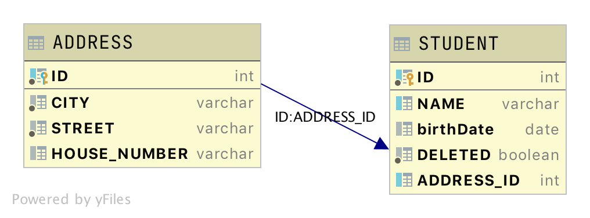
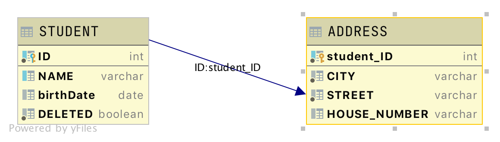
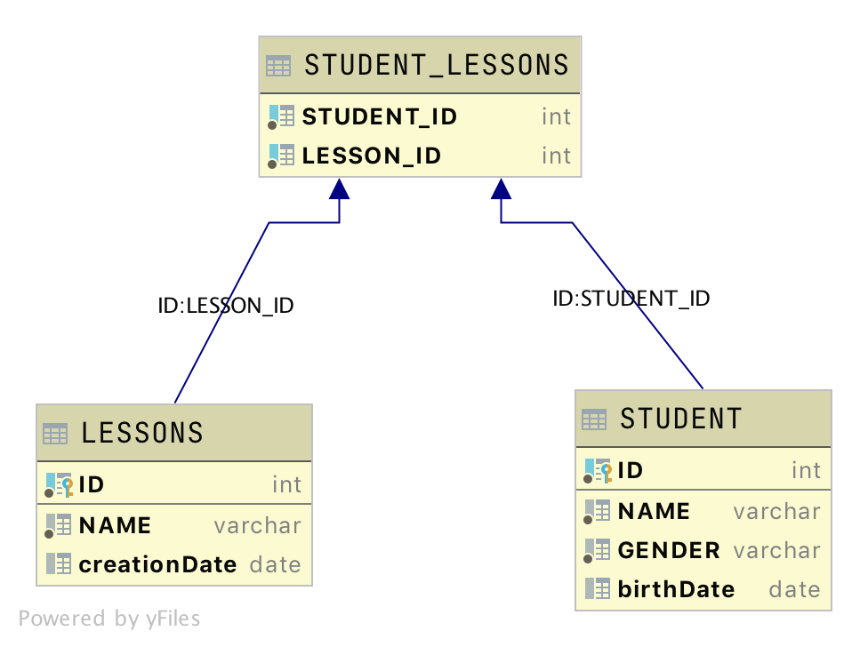

# Fibabanka Java Bootcamp - 4. Hafta

## Annotasyonlar
JDK 5 versiyonuyla birlikte Java programlama diline kazandırılan annotasyonlar kaynak Java kodları ile ilgili meta bilgileri
kaynak kodlara eklemeyi mümkün kıldı. Peki bu ne demek ? Diyelim ki bir kodunuz var bu bir class, metod, instance variable 
yada metod parametresi olabilir; siz bütün kod parçalarına ek bilgiler ekleyebiliyorsiniz ve bu bilgiler doğrudan kodun 
çalışmasına etki etmezken bazı frameworkler ve kod üreticiler bu bilgileri kullanarak kodunuzu zenginleştirebilir. 

Bir annotasyon yarattmak için aşağıdaki genel yapı kullanılabilir;
```java
@interface NameOfAnnotation {
    type fieldName();
    type anotherFieldName();
}
```
Annotasyonlar interfacelerden yaratılır ve içerisinde daha  sonra annotasyonda kullanacağımız fieldlar için birer metod 
tanımlanır. Burada kullanılan **@** ifadesi bu interfacein bir annotasyon olduğunu bildirir compilera. Bu annotasyonun 
tanımlama kısmıydı, tanımladığımız annotasyonu kullanmak için aşağıdaki genel yapıyı kullanmamız gerekir;
```java
// Annotate a method.
@NameOfAnnotation(fieldName = value, anotherFieldName = anotherValue)
public static void myMeth(){ 
    // …
}
```
Burada interafce tanımında metod olarak tanımladığımız fieldların değişken gibi parantez olmadan kullanıldığına dikkat edelim.

### Retention policy ile annotasyonların görünürlüğünü ayarlamak
Java programlama dilinde bir kod parçasının yaşam döngüsü 3 aşamadan oluşmaktadır; kodun yazıldığı andan compile oluncaya kadar 
geçen dönem(source code), compile olup .class uzantılı dosyaların yaratıldığı dönem(compilation) ve .class uzantılı dosyaların 
JVM tarafından çalıştırıldığı dönem(runtime). Java programlama dili tarafından built-in sağlanan @Retention annotasyonu ile
yarattığımız annotasyonların bu yaşam döngüsünde hangi aşamaya kadar görülebilir olacağını belirtebiliriz. Bunu yaparken 
kullanacağımız genel yapı aşağıdaki gibi;

```java
import java.lang.annotation.Retention;

@Retention(retentionPolicy)
@interface NameOfAnnotation {
    type fieldName();

    type anotherFieldName();
}
```
Bu yapıda retentionPolicy java.lang.annotation.RetentionPolicy enum yapısı tarafından sağlanan **SOURCE, CLASS,** veya **RUNTIME**
değerlerinden birisi olmalıdır. SOURCE ifadesi annotasyonun yalnızca source code aşamasında, yani compile zamanına kadar
görülebilir olacağını compile zamanında .class uzantılı dosyalara dahil edilmeyeceğini bildirir. CLASS ifadesi ise annotasyonun
compile zamanında .class uzantılı dosyalara da dahil edileceğini ve runtimeda JVM tarafından görüntülenemeyeceğini bildirir.
RUNTIME ifadesi ise annotasyonun çalıştırma zamanında da JVM tarafından görünür olacağını belirtir ve annotasyona tüm yaşam 
döngüsünde görünür olma imkanı verir. Her annotasyonun bu SOURCE, CLASS, veya RUNTIME retention ifadelerinden birine sahip 
olması gerekir ve CLASS ifadesi default değer kabul edilir. 

Şimdi buraya kadar anlattıklarımızı bir örnekle görelim;
```java
@Retention(RetentionPolicy.RUNTIME)
@interface MyAnnotation {
  String name();
  int val();
}
```

### Annotasyonlar ile tanımlanan meta verilere erişim
Annotasyonlar ile kod parçalarına meta veriler eklenebildiğini gördük, peki eklenen bu verileri nasıl kullanabiliriz ?
SOURCE ve CLASS retention ile tanımlanan annotasyonlar daha çok developer ve kod üreten araçlar için demiştik. Bu noktada
bizi daha çok ilgilendiren RUNTIME retentiona sahip anotasyonlara uygulama içinden çalışma zamanında nasıl erişebiliriz onu göreceğiz.

Runtimeda annotasyonlara erişim imkanı sağlayan özelliğe **reflection** denir. Reflection kullanılarak bir objenin class bilgilerine
ve bu class bilgilerinden field bilgilerine, constructor bilgilerine ve metod bilgilerine, metod bilgilerinden de parametre 
bilgilerine kadar herşeye ulaşılabilir. O nedenle eğer bir metodun parametreleri için tanımlanmış annotasyona erişmek 
istersek sırasıyla class bilgisine, oradan metod bilgisine oradan da parametre bilgisine erişmemiz gerekir. Şimdi annotasyon 
ile bize sağlanan meta verilere runtimeda nasıl eriştiğimize bir [örnekle](../../examples/src/com/hkarabakla/annotations/MyAnnotationDemo.java) bakalım;

```java
import java.lang.annotation.Retention;
import java.lang.annotation.RetentionPolicy;

@Retention(RetentionPolicy.RUNTIME)
@interface MyAnnotation {
    String name();
    int value();
}

public class MyAnnotatedClass {

    @MyAnnotation(name = "valueForName", value = 1)
    public void annotatedMethod() {

        System.out.println("This method is annotated");
    }
}

import java.lang.reflect.Method;

public class MyAnnotationDemo {

    public static void main(String[] args) {

        MyAnnotatedClass ob = new MyAnnotatedClass();

        Class<? extends MyAnnotatedClass> obClass = ob.getClass();
        Method[] methods = obClass.getMethods();

        if (methods.length != 0) {
            MyAnnotation annotation = methods[0].getAnnotation(MyAnnotation.class);
            System.out.println("Meta information for annotated method");
            System.out.println("Name : " + annotation.name() + ", Value : " + annotation.value());
        }
    }
}
```
Çıktı :
```
Meta information for annotated method
Name : valueForName, Value : 1
```
Bu örnekte name() ve value() isminde iki tane metodu olan ve retention policy olarak RUNTIME değerine sahip MyAnnotation
isimli bir annotation tanımladık. Daha sonra bu annotasyonu MyAnnotatedClass sınıfı içindeki annotatedMethod() metodunda
kullandık. Bunu yaparken de name ve value değişkenlerine uygun değerler atatdık. Daha sonra bu değerlere MyAnnotationDemo
sınıfı içerisindeki main() metodundan eerişmeye çalıştık. 

Burada Class objesini elde ederken kullandığımız jenerik _Class<? extends MyAnnotatedClass> obClass = ob.getClass()_ ifadesine
ve değişkenlere erişmek kullandığımız _annotation.name()_ ve _annotation.value()_ ifadelerine dikkat edelim.

### Annotasyon değişkenlerine default değer atama
Yukarıda yaptığımız örnekte annotasyonun tüm değişkenlerine annotasyonu kullanırken değer atamak zorundaydık, aksi durumda 
compiler hata verirdi. Bazı durumlarda bu değişkenlere dafault değer atamak ve kullanımda değer atamayı opsiyonel hale getirmek
çok daha iyi olabilir. Bunun için annotasyon tanımında değişkenlerin default değerlerini aşağıdaki gibi verebiliriz;
```java
type member() default value;
```
default anahtar kelimesi ve hemen onu takip eden default değer, annotasyon değişkenlerini opsiyonel yapmak için yeterlidir.

Şimdi bunu bir örnekle görelim;

```java
import java.lang.annotation.Retention;
import java.lang.annotation.RetentionPolicy;

@Retention(RetentionPolicy.RUNTIME)
@interface MyAnnotationWithDefault {
    String name() default "defaultValueForName";
    int value() default 0;
}


import java.lang.annotation.Retention;
import java.lang.annotation.RetentionPolicy;

@Retention(RetentionPolicy.RUNTIME)
@interface MyAnnotation {
    String name();
    int value();
}


public class MyAnnotatedClass {

    @MyAnnotation(name = "valueForName", value = 1)
    public void annotatedMethod() {

        System.out.println("This method is annotated");
    }

    @MyAnnotationWithDefault
    public void annotatedMethodWithDefaultValues() {

        System.out.println("This method is annotated with default values");
    }
}


import java.lang.annotation.Annotation;
import java.lang.reflect.Method;

public class MyAnnotationDemo {

    public static void main(String[] args) {

        MyAnnotatedClass ob = new MyAnnotatedClass();

        Class<? extends MyAnnotatedClass> obClass = ob.getClass();
        Method[] methods = obClass.getMethods();

        for (Method m : methods) {
            for (Annotation a: m.getAnnotations()) {
                System.out.println(a);
            }
        }
    }
}
```
Çıktı :
```
@com.hkarabakla.annotations.MyAnnotationWithDefault(name=defaultValueForName, value=0)
@com.hkarabakla.annotations.MyAnnotation(name=valueForName, value=1)
```

Bu örnekte bi önceki örnekte kullandığımız annotasyon tanımının bir benzerini default değerler ile yaptık. Ve bu iki annotasyonu
farklı metodlar için kullandık. main() metodu içerisinde ise tüm annotasyonlar değerleri ile birlikte ekrana yazdırıldı.
Hiçbir değer vermediğimiz halde MyAnnotationWithDefault isimli annotasyonun default değerleri aldığına dikkat edelim. Ayrıca
annotasyona hiçbir değer vermek istemediğimizde annotasyon isminden sonra () ifadesini kullanmaya gerek olmadığını unutmayalım. 

Bu örnekteki MyAnnotationWithDefault annotasyonunu referans aldığımız zaman aşağıdaki ifadelerin hepsi birbirine denktir;

```java
@MyAnnotationWithDefault
@MyAnnotationWithDefault(name = "defaultValueForName")
@MyAnnotationWithDefault(value = 0)
@MyAnnotationWithDefault(name = "defaultValueForName", value = 0)
```

Ve bir annotasyon sadece tek bir değişken bulunduruyor ise kullanımda değişken ismi kullanılmayabilir, bu durumda aşağıda 
gösterildiği gibi doğrudan değişkene atamak istediğimiz değer parantezler içerisinde gönderilir. 

```java
@Retention(RetentionPolicy.RUNTIME)
@interface AnnotationWithSingleVariable {
    String description() default "defaultValueForDescription";
}

public class MyAnnotatedClass {

    @AnnotationWithSingleVariable("new default value for description")
    public void annotatedMethod() {

        System.out.println("This method is annotated");
    }
}
```

Bu durum bir annotasyon bir yada daha fazla opsiyonel değişken ve sadece bir zorunlu değişken taşıdığı durumlarda da 
geçerlidir. Zorunlu olan değişken ismi kullanılmadan direk değer olarak gönderirlirken diğer değişkenler default değerleri 
ile kullanılabilir.

```java
@Retention(RetentionPolicy.RUNTIME)
@interface AnnotationWithSingleMandatoryVariable {
    String name()
    String description() default "defaultValueForDescription";
}

public class MyAnnotatedClass {

    @AnnotationWithSingleMandatoryVariable("value for name")
    public void annotatedMethod() {

        System.out.println("This method is annotated");
    }
}
```

Bir annotasyon hiçbir değişken bulundurmaz ise buna marker(işaretleyici) annotasyon denir. Bu annotasyonlar meta bilgisi 
taşımak yerine sadece sınıfları, metodları, değişkenleri işaretlemek için kullanılır. 

```java
@Retention(RetentionPolicy.RUNTIME)
@interface Marker {}

@Marker
public class MyAnnotatedClass {
    
    public void method() {
        System.out.println("This method is in an annotated class");
    }
}
```

### Annotasyon ttanımlarken hangi kod parçaları üzerinde kullanılabileceğini belirtme
Bir annotasyon tanımlandığı zaman bu annotasyonun hangi kod parçaları ile kullanılabileceği @Target annotasyonu ile
annotasyon tanımında belirtilebilir. Target annotasyonu ElementType enum sınıfı değerlerinden en az birini almalıdır.

| Değer           | Kullanım alanı |
| --------------- | -------------- | 
| TYPE            | Class, interface (annotasyon da dahil) ve enum tanımlarken  | 
| FIELD           | Instance değişkenlerini tanımlarken       |
| METHOD          | Metod tanımlarken       |
| PARAMETER       | Parametre tanımlarken  | 
| CONSTRUCTOR     | Constructor tanımlarken       |
| LOCAL_VARIABLE  | Lokal değişken tanımlarken       |
| ANNOTATION_TYPE | Annotasyon tanımlarken  | 
| PACKAGE         | Package tanımlarken       |

```java
@Retention(RetentionPolicy.RUNTIME)
@Target({ElementType.TYPE, ElementType.METHOD})
@interface MyAnnotation {
    String name();
    int value();
}
```

## Veritabanı İşlemleri
Veritabanı işlemleri bir uygulama için olmazsa olmazlardan biridir çoğu zaman. Java programlama dilinde farklı veritabanı 
çözümleri için farklı farklı pek çok araç geliştirilmiştir. Bunlardan bir kısmı Java dili içerisinde bize built-in sunulurken
diğer kalanları kullanmak için uygulamaya kütüphaneler eklemek gerekir. Burada önemli olan ihtiyacı anlamak ve daha sonra 
ihtiyaca en uygun yöntemi seçmektir. 

Java programlama dilinde veritabanı işlemlerini yapmak için farklı abstraction seviyelerinde API'lar sunulmuştur. 
Bunlardan ilki ve en düşük seviye abstraction sunan çözüm JDBC (Java Database Connectivity);

### JDBC kullanarak veritabanına erişim
JDBC Java programlama dili tarafından sunulan ve veritabanına bağlanmayı ve query çalıştırmayı mümkün kılan API'dır.
Genel mimarisi aşağıdaki gibidir;


JDBC API uygun driver bulunması durumunda tüm RDBMS çözümlerinde bize veritabanı işlemleri yapma imkanı sağlar. JDBC API
veritabanı işlemleri için gerekli olan abstractionı sağlar, daha sonra kendisine verilen driver ile sorguları ilgili veritabanına
iletir, sorgunun çalıştırılması sonucunda üretilen çıktıyı da java uygulamasına iletir. Burada önemli olan hangi veritabanına
bağlanılacaksa ona uygun driver(sürücü) kullanılmalı.  

Uygun veritabanı ve driver seçildikten sonra 5 adımda veritabanı işlemi gerçekleştirilebilir, bu adımlar aşağıda gösterildiği
gibidir;


#### Driver register etme
Bu işlem için Class sınıfının forName() metodunu aşağıda görüldüğü gibi çağırmak yeterlidir, forName() metoduna gönderdiğimiz
parametre kullandığımız drivera göre değişmektedir;

```java
Class.forName("com.mysql.cj.jdbc.Driver");
```

#### Veritabanına bağlantı açma
DriverManager sınıfında bulunan getConnection() metodu kendisine verdiğimiz parametreleri kullanarak bizim uygulamamız ve 
veritabanı arasında bir bağlantı kurulmasını sağlar. Bu bağlantı daha sonra kapatılması gerektiğinden Java dilinin sunduğu
try-with-resource yapısını kullanarak bağlantı açmak daha iyi olacaktır. getConnection() metodunun yapısı aşağıdaki gibidir;

```java
public static Connection getConnection(String url, String user, String password) throws SQLException
```

Bu metodun overload edilmiş farklı versiyonları da bulunmaktadır fakat bu versiyon gerekli parametreleri anlamak açısından 
en uygunu olduğu için bu eğitimde bunu kullanacağız. Burada url parametresi veritabanı adresini, user parametresi veritabanı
kullanıcı ismini ve password de bu kullanıcının şifresini temsil etmektedir, url seçtiğimiz veritabanına göre farklılık 
gösterebilir. Şimdi nasıl bağlantı açabileceğimizi bir örnekle görelim;

```java
try (Connection con = DriverManager.getConnection("jdbc:mysql://localhost:3306/myDb", "user1", "pass")) {
    // ... codes to use connection
}
```

#### Sorgu çalıştırmak için statement yaratma
Oluşturduğumuz SQL sorgularını çalıştırmak için Statement interfaceinden türetilen objeler yaratmamız gerekir. Java 
programlama dilinde Statement interfaceini extend eden iki tane daha interface vardır; PreparedStatement ve CallableStatement. 
Şimdi bu interfacelerin nasıl kullanıldığına detaylıca bakalım;

#### Statement
Statement interfacei SQL komutlarını çalıştırmak için gerekli olan temel metodları içerir. Bu metodların başında aşağıdaki
metodları sayabiliriz;

* **ResultSet executeQuery(String query)** : SELECT SQL sorgularını çalıştırmak için kullanılır, parametre olarak String tipinde select 
  sorgusunu alır ve elde ettiği sonuçları ResultSet objesi olarak geri döner.
* **int executeUpdate(String query)** : INSERT, UPDATE ve DELETE sql komutlarının çalıştırılmasında kullanılır. Ayrıca SQL DDL 
  komutları gibi hiçbirşey dönmeyen sadece veritabanı bileşenleri üzerinde işlem yapan komutları çalıştırmak için de kullanılabilir.
  INSERT, UPDATE ve DELETE komutları çalıştırıldığı zaman bu komuttan etkilenen kayıt sayını return eder.
* **boolean execute(String query)** : Bu metod daha çok çalıştırdığımız sorgunun ne tarz bir sorgu olduğunu bilmediğimiz
  durumlarda işe kullanışlı olur. Yukarıdaki iki metodun da çalıştırabildiği sorguları çalıştırabilen bu metod ayrıca 
  birden fazla ResultSet dönen sorguların(store procedure) da sonuçlarına erişim sağlar. Eğer çalıştırdığımız sorgu bir 
  sonuç dönerse execute metodu true döner, bu durumda execute metodu sonunda getResultSet() metodunu çağırıp sorgudan dönen 
  ResultSet objesine erişilir, eğer birden fazla ResultSet dönülmüşse bu drumda hemen arkasından getMoreResults() metodu
  dönen diğer sonuçları almak için çağrılmalıdır. Eğer çalıştırdığımız sorgu bir insert, update yada delete sorgusu ise
  bu durumda execute metodu false döner ve etkilenen kayıt sayısını almak için getUpdateCount() metodu çağrılmalıdır.

Şimdi bu metodları kullanarak bir tablo yaratalım ve içerisine kayıtlar koyalım, sonrasında da bu kayıtları tablodan select
sorgusu ile çekelim, [örnek](../../examples/src/com/hkarabakla/jdbc/JdbcStatementDemo1.java);

```java
import java.sql.*;

public class JdbcStatementDemo1 {
    public static void main(String[] args) {

        try (Connection connection = DriverManager.getConnection("jdbc:h2:mem:demo", "admin", "admin")) {

            try (Statement statement = connection.createStatement()) {

                String ddlSql = "CREATE TABLE IF NOT EXISTS employees"
                        + "(emp_id int PRIMARY KEY AUTO_INCREMENT, name varchar(30),"
                        + "position varchar(30), salary double)";

                statement.execute(ddlSql);

                String insertSql = "INSERT INTO employees(name, position, salary)"
                        + " VALUES('john', 'developer', 2000)";

                if (statement.executeUpdate(insertSql) == 1) {

                    String selectSql = "SELECT * FROM employees";

                    ResultSet resultSet = statement.executeQuery(selectSql);

                    while (resultSet.next()) {

                        String employee = "Id : '" + resultSet.getInt(1) + "' name : '"
                                + resultSet.getString(2) + "' position : '"
                                + resultSet.getString(3) + "' salary : '"
                                + resultSet.getDouble(4) + "'";

                        System.out.println(employee);
                    }
                }
            }

        } catch (SQLException ex) {
            ex.printStackTrace();
        }
    }
}
```  
Çıktı :
```
Id : '1' name : 'john' position : 'developer' salary : '2000.0'
```
Bu örnekte önce execute() metodunu DDL scripti ile çağırarak ihtiyacımız olan veritabanı tablosunu yarattık, sonrasında
insert scripti ile executeUpdate() metodunu çağırdık ve daha önce yarattığımız tabloya veri ekledik. Son olarak da eklediğimiz
verileri görüntülemek için select scriptini executeQuery() metodu ile çalıştırdık. ResultSet üzerinde dolaşarak elde ettiğimiz
sonuçları ekrana yazdık. ResultSet üzerinde dönen herbir satırı almak için next() metodunu çağırdığımıza dikkat edelim. 

#### PreparedStatement
PreparedStatement interfacei önceden compile edilmiş parametrik SQL sorgularını çalıştırmak için kullanılır. Burada önemli
olan sorgunun parametrik olması ve dinamik olarak parametrelerin gönderilebilmesidir, önce sorgu compile edilir statement 
yaratılırken daha sonra parametreler set edilir. Son olarak yukarıda bahsettiğimiz kurallar geçerli olmak üzere execute(),
executeUpdate() ve executeQuery() metodları çalıştırılır. Genel kullanım aşağıdaki gibidir;

```java
String updatePositionSql = "UPDATE employees SET position=? WHERE emp_id=?";
try (PreparedStatement pstmt = con.prepareStatement(updatePositionSql)) {
    
    pstmt.setString(1, "junior developer");
    pstmt.setId(2, 1);
    
    int rowsEffected = pstmt.executeUpdate();
}
```

Burada parametreleri veri tiplerini kullanarak ve indeksler üzerinden nasıl set eettiğimize dikkat edelim.

#### CallableStatement
CallableStatement stored procedure çalıştırmak için kullanılır. PreparedStatement gibi önceden compile olmuş sorgular 
çalıştırılır ve parametreleri dinamik olarak set edilir. Stored procedurelar dğer return edebildiği için eğer çalıştırdığımız
stored procedure bir değer dönüyor ise bu durumda registerOutParameter() metodu çağrılarak output parametresi register edilmeli.
Genel kullanım aşağıdaki gibidir;

```java
String preparedSql = "{call insertEmployee(?,?,?,?)}";
try (CallableStatement cstmt = con.prepareCall(preparedSql)) {
      cstmt.setString(2, "NewGuy");
      cstmt.setString(3, "PO");
      cstmt.setDouble(4, 8000);

      cstmt.registerOutParameter(1, Types.INTEGER);

      cstmt.execute();
      int new_id = cstmt.getInt(1);
}
```

Bu örnekte stored procedure ile yeni bir kayıt oluşturduğumuz için bundan etkilenen satır sayısını alabilmeek için
registerOutParameter() metodu aracılığı ile bir output beklediğimizi ve bunun integer tipinde olduğunu belirttik. Sonrasında
execute() metodunu çağırdıktan sonra getInt() metodunu çağırarak daha önce register ettiğimiz çıktıyı elde ettik.

#### Transaction yönetimi
Bazı durumlarda aynı yada farklı tablolar üzerinde birden fazla sorgu çalıştırır ve veri üzerinde değişiklik yaparız, 
bu durumda yaptığımız değişiklik herhangi bir adımda hata alırsak tamamen geri alınsın isteriz. İşte bu durumda aynı transaction 
içerisinde daha önce yaptığımız başarılı değişiklikleri geri almak için connection objesinin autoCommit özelliğini false yaparız
ve commit işleemini manuel olarak istediğimiz noktadan çağırırız. Şimdi bunu bir örnek üzerinde görelim;

```java
String updatePositionSql = "UPDATE employees SET position=? WHERE emp_id=?";
PreparedStatement pstmt = con.prepareStatement(updatePositionSql);
pstmt.setString(1, "senior developer");
pstmt.setInt(2, 1);

String updateSalarySql = "UPDATE employees SET salary=? WHERE emp_id=?";
PreparedStatement pstmt2 = con.prepareStatement(updateSalarySql);
pstmt2.setDouble(1, 3000);
pstmt2.setInt(2, 1);

boolean autoCommit = con.getAutoCommit();
try {
    con.setAutoCommit(false);
    pstmt.executeUpdate();
    pstmt2.executeUpdate();
    con.commit();
} catch (SQLException exc) {
    con.rollback();
} finally {
    con.setAutoCommit(autoCommit);
}
```
Bu örnekte bir çalışanın pozisyonunu ve buna bağlı olarak maaşını iki adımda değiştirmek istedik. Bunu connection objesi
üzerinden autoCommit özelliğini kapatarak bir transaction açmış olduk, tüm işlemler başarılı olması durumunda ise commit()
metodunu çağırarak transactionu başarıyla sonlandırdık. Ve bu sorgulardan herhangi birini çalıştırırken hata alırsak aynı 
transaction içindeki önceki başarılı işlemleri rollback() metodunu çağırarak geri aldık.

### JPA (Java persistence API)
JPA Java programlama dilinde Java sınıfları ile ilişkisel veritabanı tablolarını ilişkilendirmek için ortaya çıkmış bir standarttır.
Burada amaç sınıf değişkenleri ile tablonun kolonlarını eşleştirmek ve SQL yazmadan nesneler üzerinden doğrudan veritabanı
işlemlerini yapmaktır. Bu noktada JPA sadece bir standart ortaya koyar ve veri üzerinde kendisi bir işlem yapmaz. Bunun 
için bu standartları implemente eden ayrı bir araca ihtiyaç vardır, JPA implementasyonu yapan başlıca araçlar olarak 
Hibernate, TopLink, EclipseLink ve OpenJPA sayılabilir.

JPA spesifikasyonunda obje-tablo ilişkisini yönetmek için iki tane yöntem bulunur; annotasyonlar ve XML konfigürasyon dosyaları
JPA için gerekli olan meta bilgisini oluşturmaya yarar. İkisini birden kullanmak da mümkün bu durumda XML konfigürasyonu 
annotasyonları ezer.

JPA yukarda bahsettiğimiz standartları şu temel sınıf ve interfaceleri aracılığı ile sağlar; Persistence, 
EntityManagerFactory, EntityManager, EnityTransaction, Query ve Entity.

* Persistence : EntityManagerFactory objesi almak için static bir metod sağlar.
* EntityManagerFactory : EntityManager yaratmak için gerekli olan metodları barındırır.
* EntityManager : Persistence işlemlerini yönetmek için kullanılır, bu interface in sağladığı metodlar aracılığı ile sorgular yaratılır.  
* EnityTransaction : Bir grup veritabanı işlemini tek bir işlem gibi aynı anda veritabanına yazmaya yada birisinde hata olunca daha önce 
  aynı grup içinde başarılı olan işlemleri geri almaya yarayan transaction ları yönetmek için kullanılır.
* Query : Veritabanı tablolarıyla eşleştirilen ve Entity adı verilen sınıflardan yaratılan objeler üzerinden sorgu yaratmak için kullanılır. 
* Entity : Java sınıflarını veritabanı tablolarına eşleştirmek için kullanılır.

#### Entity tanımlama
Entity tanımlarken bu eğitimde annotasyonları kullanacağız, bu annotasyonların detaylarına aşağıdaki örnek üzerinden değinelim;

```java
public enum Gender {
    MALE, FEMALE
}

import javax.persistence.*;
import java.time.LocalDate;

@Entity(name = "student")
@Table(name = "students", schema = "schema_1")
public class Student {

  @Id
  @GeneratedValue(strategy = GenerationType.AUTO)
  private int id;

  @Column(nullable = false, length = 100, unique = false)
  private String name;

  @Temporal(TemporalType.DATE)
  private LocalDate birthDate;

  @Transient
  private int age;

  @Enumerated(EnumType.STRING)
  private Gender gender;

  private boolean deleted = false;
}
```
* @Entity : Sınıfları entitiy olarak framework e tanıtmak için kullanılır, aldığı name parametresi daha sonra sorgularda 
  bu sınıfa atıfta bulunmak için kullanılır
* @Table : Tablo ismi, schema ismi, tablo üzerinde tanımlanan indeksler gibi veritabanı tablosu ile ilgili bilgileri sağlar 
* @Id : Tablodaki unique identifier(ayırt edici) kolonunu sınıftaki ilgili değişken ile eşleştirmek için kullanılır
* @GeneratedValue : @Id annotasyonu ile işaretlenen değişkenin değerinin nasıl üretileceğini belirtir
* @Column : İlgili değişkenin karşılığı olan ttablodaki kolonla ilgili bilgileri sağlar
* @Temporal : Tarih tipindeki değişkenleri tabloda karşılayan kolonun ttipini belirtmek için kullanılır
* @Transient : Veritabanına kaydetmek istenilmeyen değişkenleri işaretlemek için kullanılır 
* @Enumerated : Enum tipinde tanımlanan değişkenlerin veritabanına nasıl kaydedileceğini belirler

Entityleri kaydederken default değerler belirlemek için entity sınıfı üzerinde örnekte deleted değişkeninde gösterildiği
gibi default değer verilebilir.

#### Entityler arası ilişki tanımlama
Veritabanı tasarlanırken tablolar arası ilişkiler çok farklı şekillerde tanımlanabilir. Burada tasarım tamamen tasarımı
yapan kişiye kalmış olmakla birlikte ihtiyaç ve teknik zorluklarda göz önünde bulundurulmalıdır. Veritabanı tasarımını
Java entityleri üzerinde nasıl gerçekleyebiliriz bunlara bakalım;

##### One-to-One
Veritabanı tabloları arasında bulundurdukları kayıtlar arasında bire bir ilişki varsa buna one-to-one ilişki denir.
One-to-one ilişki veritabanı üzerinde farklı şekillerde uygulanabilir; Foreign key kullanımı ve paylaşımlı primary key kullanımı .

###### Foreign key kullanımı 
Aşağıda ER diagramı gösterilen durumdur, bir table diğer tablonun id colunu kendisinde başka bir kolona foreign key olarak eşler.



Şimdi bunu JPA kullanarak nasıl gerçekleştiririz onu görelim;
```java
@Entity(name = "student")
@Table(name = "students", schema = "schema_1")
public class Student {

    @Id
    @GeneratedValue(strategy = GenerationType.AUTO)
    private int id;

    @Column(nullable = false, length = 100, unique = false)
    private String name;

    @Temporal(TemporalType.DATE)
    private LocalDate birthDate;

    @Transient
    private int age;

    @Enumerated(EnumType.STRING)
    private Gender gender;

    @OneToOne(cascade = CascadeType.ALL)
    @JoinColumn(name = "address_id", referencedColumnName = "id")
    private Address address;

    private boolean deleted = false;
}


@Entity
public class Address {

  @Id
  @GeneratedValue
  private int id;

  private String city;

  private String street;

  private String houseNumber;

  @OneToOne(mappedBy = "address")
  private Student student;
}
```

###### Paylaşımlı primary key kullanımı
Aşağıda ER diagramı gösterilen durumdur, bir table diğer tablonun id colunu kendisinde başka bir kolona foreign key olarak eşler
bu tabloda foreign key aynı zamanda primary key olarak da kullanılır.



Şimdi bunu JPA kullanarak nasıl gerçekleştiririz onu görelim;
```java
@Entity(name = "student")
@Table(name = "students", schema = "schema_1")
public class Student {

    @Id
    @GeneratedValue(strategy = GenerationType.AUTO)
    private int id;

    @Column(nullable = false, length = 100, unique = false)
    private String name;

    @Temporal(TemporalType.DATE)
    private LocalDate birthDate;

    @Transient
    private int age;

    @Enumerated(EnumType.STRING)
    private Gender gender;

    @OneToOne(mappedBy = "student", cascade = CascadeType.ALL)
    @PrimaryKeyJoinColumn
    private Address address;

    private boolean deleted = false;
}

@Entity
public class Address {

  @Id
  @Column(name = "student_id")
  private int id;

  private String city;

  private String street;

  private String houseNumber;

  @OneToOne
  @MapsId
  @JoinColumn(name = "student_id")
  private Student student;
}
```

##### One-to-Many, Many-to-One
Veritabanı tablolarından birindeki bir kayıda kaşılık diğer tabloda birden fazla kaydın bulunması durumudur.


Şimdi bunu JPA kullanarak nasıl gerçekleştiririz onu görelim;
```java
@Entity(name = "student")
@Table(name = "students", schema = "schema_1")
public class Student {

  @Id
  @GeneratedValue(strategy = GenerationType.AUTO)
  private int id;

  @Column(nullable = false, length = 100, unique = false)
  private String name;

  @Temporal(TemporalType.DATE)
  private LocalDate birthDate;

  @Transient
  private int age;

  @Enumerated(EnumType.STRING)
  private Gender gender;

  @OneToMany(mappedBy = "student", cascade = CascadeType.ALL)
  private Set<Grades> grades;

  private boolean deleted = false;
}

@Entity
public class Grades {

  @Id
  @Column(name = "student_id")
  private int id;

  private String lessonName;

  @Temporal(TemporalType.DATE)
  private LocalDate creationDate;

  @ManyToOne
  @JoinColumn(name = "student_id")
  private Student student;
}
```

##### Many-to-Many
Veritabanında bulunan iki tablo arasında, tablolardaki herbir kayda karşılık diğer ttabloda birdeen fazla kaydın bulunması durumudur.



Şimdi bunu JPA kullanarak nasıl gerçekleştiririz onu görelim;
```java
@Entity(name = "student")
@Table(name = "students", schema = "schema_1")
public class Student {

    @Id
    @GeneratedValue(strategy = GenerationType.AUTO)
    private int id;

    @Column(nullable = false, length = 100, unique = false)
    private String name;

    @Temporal(TemporalType.DATE)
    private LocalDate birthDate;

    @Transient
    private int age;

    @Enumerated(EnumType.STRING)
    private Gender gender;

    @ManyToMany
    @JoinTable(
            name = "student_lessons",
            joinColumns = @JoinColumn(name = "student_id"),
            inverseJoinColumns = @JoinColumn(name = "lesson_id"))
    private Set<Lesson> registeredLessons;

    private boolean deleted = false;
}


@Entity
public class Lesson {

  @Id
  @Column(name = "student_id")
  private int id;

  private String name;

  @Temporal(TemporalType.DATE)
  private LocalDate registrationDate;

  @ManyToMany(mappedBy = "registeredLessons")
  private Set<Student> students;
}
```
