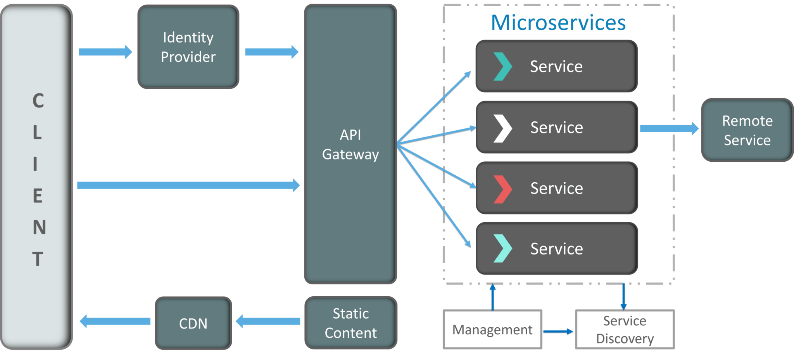

# Fibabanka Java Bootcamp - 6. Hafta

## RESTFULL API tasarımı
- Request body kısmında JSON kabul et ve servisten JSOn tipinde reponse dön 
- Fiiller yerine urlde sadece isimlere yer verilmeli, örneğin bir post endpointinin urli `POST /api/user/create` olmamalı
  POST metodu bu işlemin bir resource yaratma işlemi olduğunu belirtiyor zaten bunun yerine `POST /api/user` tercih edilmeli  
- Eğer endpoint bir collection dönüyor ise bu durumda endpoint urlinde çoğul isimler teercih edilmeli, `GET /api/users` gibi
- Hiyerarşik objeeleerimmiz varsa bunlara karşılık geleen resourcelar da hiyerarşik vee iç içe olamı
- Exceptionlar doğru şekilde yakalanmalı ve uygun hata http status kodları kullanılmalı
- Filtreleme, sıralama ve paging APIın endpointlerinde bulunmalı
- Security pratiklerini implemente etmeli
- Resource caching performans artırmak için kullanılmalı 
- API lar da versiyonlama yapılmalı, `GET /api/v1/user` gibi

## Spring Boot


Daha önce Spring Framework ve bu frameworkun hayatımıza kattıklarına bakmıştık. Bu bölümde Spring Framework üzerine inşa edilmiş
olan Spring Boot detaylarına bakacağız. 

Spring framework; Spring JDBC, Spring MVC, Spring Security gibi Java ile uygulama geliştirmeyi kolaylaştıran harika modüllerden
oluşmaktadır. Fakat bu modülleri kullanabilmek için pek çok konfigürasyon yapmak gerekir. Bütün bu konfigürasyonları daha 
kolay hale getirmek için Spring Boot'a auto-configuration özelliği eklenmiştir. Spring Boot bir uygulamanın ihtiyacı olan
pek çok konfigüreasyonu default değerler ile projeye kazandırır fakat gerektiği zaman bu konfigürasyonları override etmemize de
izin verir.

Spring MVC ile bir web uygulaması geliştirdiğimiz zaman uygulamayı çalıştırabilmek için bir application sunucusuna ihtiyaç
duyulur. Tomcat, Jetty gibi uygulama sunucuları geliştirdiğimiz uygulamaları deploy etmek ve çalıştırabilmek için konfigüre
edilmesi gerekir. Spring Boot bu konfigürasyon işlemini ortadan kaldırmak için application sunucusunu, yazdığımız uygulamanın
derleenmesi sonucu ortaya çıkan jar dosyasına embedded olarak konulmaktadır. Yani harici bir application sunucusuna gerek 
yoktur.

Spring Framework ile uygulama geliştirirken ihtiyacımız olan bağımlılıkları Maven yada Gradle aracılığıyla projeye eklenebilir.
Maven/Gradle transitive bağımlılıkların çözümlenmesi ve projenin classpathine eklenmesi konusunda çok iyi iş çıkarsa da 
doğrudan ilişkisi olmayan ama genellikle birlikte kullanılan bağımlılıkları çözümleyemez. Bu noktada Spring Boot 
starter denilen ve birbiri ile ilişkili bağımlılıkları grup halinde projeye ekleme olanağı sunan özelliğiyle karşımıza çıkıyor.  

Bunların yanında Spring Boot bize prod ortamına deploy etmeye hazır bir takım özellikler de sunuyor; metrikler, health checkler
ve external config gibi. Prod ortammında çalışan her uygulamanın ihtiyaç duyduğu bu özellikler Spring Boot ile otomatik olarak
uygulamaya eklenir.

Şimdi bütün bu özellikler nasıl kullanılır daha detaylı bakalım;

### Spring Boot nasıl kullanılır

#### Kod düzeni
Spring Boot uygulamalarında da diğer Spring Framework uygulamalarında olduğu gibi `Layered Architecture` dediğimiz yapıda 
olmalıdır. Spring Boot uygulamalarının çalışması için gereken @SpringBootApplication anotasyonu genelde main() metodun bulunduğu
sınıfa verilir ve bu sınıf root package'ın içinde yer alır. Daha sonra kalan diğer sınıflar entity isimlerine göre aşağıda gösterildiği
gibi package'lara ayrılır.

```
com
 +- example
     +- myapplication
         +- Application.java
         |
         +- customer
         |   +- Customer.java
         |   +- CustomerController.java
         |   +- CustomerService.java
         |   +- CustomerRepository.java
         |
         +- order
             +- Order.java
             +- OrderController.java
             +- OrderService.java
             +- OrderRepository.java
```

#### Auto configuration
Spring Boot pek çok boilerplate konfigürasyonu arka planda otomatik olarak yapar, bunu classpath'deki jarları tarayarak 
yapar. Örneğin classpath'de H2 varsa Spring Boot in memory bir veritabanından datasource objesini ve gerekli diğer 
beanleri otomatik olarak oluşturur ve Spring contextine koyar. Otomatik konfügüre edilen beanlerden birini kendimiz oluşturarak 
override etmek istersek bu durumda o beani bir configuration sınıfı altında oluşturmamız yeterlidir. Bir oto konfigürasyon 
sınıfını tamamen disable edebiliriz bunun için S@pringBootApplication anotasyonun exclude fieldını doldurmak yeterli olur.

```java
import org.springframework.boot.autoconfigure.*;
import org.springframework.boot.autoconfigure.jdbc.*;

@SpringBootApplication(exclude={DataSourceAutoConfiguration.class})
public class MyApplication {
}
```

#### Spring Boot ve dependency injection
Yukarıdaki yapıda proje yapısı oluşturulduğu zaman @SpringBootApplication anotasyonu projenin root paketinde yer aldığında 
root paket ve altındaki alt paketlerde yeralan bütün spring beanlerini otomatik olarak tarayabilir. Bunu @SpringBootApplication
anotasyonu içinde yeralan @ComponentScan anotasyonu yardımıyla yapar. Bu durumda @Component, @Service, @Repository, @Controller gibi
anotasyonlar ile işaretlenen beanler otomatik olarak contexte eklenir.


## Microservice Pattern

### Monolith uygulama nedir ?
Geleneksel uygulama mimarisi olan Monolith mimarisi, pek çok modülün ve çözümün bir araya gelerek tek bir uygulama oluşturmasıyla
oluşur. Örnek olarak bir e ticaret uygulamasını ele alabiliriz; bu uygulamanın bir ürün modülü, kategori modülü, kullanıcı modülü,
stok modülü, sipariş modülü, teslimat modülü olduğunu düşünelim. Bütün bu modüllere ait kodların tek bir repositoryde tutulduğunu
ve uygulama derlendiği zaman ortaya tek bir war dosyasının çıktığını düşünelim.


Bu mimarinin getirdiği avantajlar ve dezavantajları düşündüğümüzde karşımıza şöyle bir liste çıkıyor;

**Avantajlar:**
* Tüm uygulama kodu bir arada olduğu için deployment süreci basittir.
* Uygulama geliştirmesi nispeten daha hızlı ve kolaydır, çünkü kod tekrarı azdır, modüller birbirlerinden kodları kullanabilirler.

**Dezavantajlar:**
* Monolith uygulamalarda bütün uygulama kodu aynı repositoryde olduğundan tek bir programlama dili kullanılması zorunluluğu vardır.
  Günümüzde pek çok programala dili farklı problemleri çözmek için ortaya çıkmıştır. Uygulama içerisinde karşılaşılabilecek 
  farklı problemler farklı programlama dilleri ile kolayca çözülebilecekken, aynı programlama dilini kullanma zorunluluğu 
  işleri zorlaştırmaktadır.
* Uygulamanın tek bir modülünde değişiklik yapılması durumunda bile bütün uygulamanın build edilmesi gerekir. Bu da uygulamanın
  tüm kısımlarının tekrar test edilmesini gerektirir.
* Uygulama içerisinde bir modül diğer modüllerden çok daha fazla istek alabilir, bu durumda uygulamanın iyi performans göstermesi
  için uygulamayı scale etmek (uygulamayı daha fazla uygulama sunucusuna deploy etmek) gerekir. Tüm modüller tek bir war 
  dosyası içerisinde paketlenmiş olduğundan bütün uygulamayı scale etmek gerekir, buna horizontal scaling denilir.
* Modüller arası iletişim için kod paylaşımı yapılır, bu paylaşımından kaynaklı modüller arası bağımlılık yüksektir.
* Modüller arası kod paylaşımı aynı zamanda farklı modüller üzerinde çalışan takımlar arasında da bağımlılık yaratır.

### Microservice nedir ?
Yukarda bahsettiğimiz sorunlara çözüm olarak microservice mimarisi ortaya atılmıştır. Microservice mimarisinde yukarıdaki
örneği düşündüğümüz zaman her bir modül kendi başına bir uygulama gibi ayrı bir repositorye sahiptir ve tek başına derlenip
deploy edilebilir. Microservice mimarisinde bu sorunlar etkin bir şekilde çözülürken yapısındaki karmaşadan dolayı ortaya 
çözülmesi gereken başka sorunlar çıkmıştır. 


Şimdi öncelikle avantaj ve dezavantajlarına bakalım;

**Avantajları**
* Herbir microservice tek bir repositoryde bulunduğundan teknoloji bağımlılığı ortadan kalkmıştır, herbir service farklı programlama
  dili ve teknolojiler kullanılarak geliştirilebilir.
* Herbir microservice tek başına build edilebildiği için bir microservicede bir değişiklik olduğunda sadece o servisi build 
  etmek ve deploye etmek yeterlidir. Devamında da sadece o servisi test etmek yeterli olacaktır.
* Çözüm içerisinde bir microservice yoğun trafik alması yada performans sorunları yaşaması durumunda sadece o servisi scale
  etmek yeterli olacaktır, buna vertical scaling denilir.
* Modüller arası iletişim API yada message brokerlar aracılığıyla gerçekleştirildiğinden herhangi bir kod paylaşımı iletişim
  için söz konusu değildir, bu da microserviceler arası bağımlılıkları yok eder.
* Her bir microservice yada bir kaçı tek bir takım tarafından geliştirildiği için ve servisler arası kod paylaşımı olmadığı için
  her takım birbirinden bağımsız hareket edebilir.

**Dezavantajları**
* Bu dağıtık mimarinin getirdiği bir takım veri bütünlüğü sorunları ortaya çıkabilir.
* Herbir istek birden fazla microservis tarafından farklı teknolojiler ve yaklaşımlarla işlendiği için transaction yönetimi
  zordur.
* Microserviceler arası iletişimi yönetmek monolith uygulamalara göre çok daha zordur. Servislerin birbirini otomatik bulması 
  gibi ihtiyaçlar ortaya çıkar.
* Dağıtık bir log yönetimine ihtiyaç vardır, bir request exception aldığında hatanın hangi microserviste meydana geldiğini 
  anlamak için dağıtık log yönetim araçlarına ihtiyaç olur.
* Çok fazla tekrarlı kod yazılması gerekir, özellikle servisler arası iletişim noktasında.
* Uçtan uca senaryoları debug etmek zordur.
*

### Microservice mimarisi bileşenleri



1. API Gateway : Hernekadar arka planda pek çok microservice bulunsa da clientın bakış açısından ortada tek bir uygulama
   vardır, işte bu nedenle client istekleri tek bir host kullanarak yapar. Bu istekleri microservicelerin önünde bulunan 
   API Gateway yakalar ve her isteği ilgili microservice e yönlendirir.
2. Identity Provider : Client için authentication ve authorization bilgilerini tutan, clientın login olması sonucunda 
   clienta uygulamaya erişim için erişim tokeni veren ve microservislerin bu tokeni doğrulamasını sağlayan merkezi kimlik yönetimi
   uygulamasıdır.
3. Management : Uygulamaları scale etmek gibi operasyonları yöneten araç
4. Service discovery : Mıcroservislerin ileetişim için birbirlerini otomatik olarak bulmasını sağlayan, bunu da her servisin
   ayağa kalkınca gelip discovery servisine register olması sonu yapabilen araç.

#### Microserviceler arası iletişim
Microserviceler iletişim kurarken iki farklı yol kullanır;
1. HTTP üzerinden rest apilar kullanarak iletişim
2. AMQP gibi asenkron mesajlaşma protokolleri üzerinden iletişim

